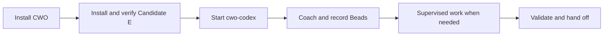

# Complex Work Orchestration

Complex Work Orchestration, or CWO, is a public Codex skill package for work
that needs more structure than one long coding-agent session. It combines a
named architect contract, durable Beads task records, bounded worker execution,
independent review, validation evidence, and recovery-quality handoff.

The normal CWO path uses **Candidate E** as the architect contract. A fresh
`cwo-codex` session loads that contract without changing ordinary Codex
sessions. The Candidate E decision thread owns architecture and final judgment;
when work is delegated, a supervised native Spark worker performs the bounded
operative task.

Use CWO when the work needs any of these:

- A durable task record that survives summarization, restart, or handoff.
- A clear acceptance map before implementation.
- Bounded worker execution with model, tool, time, and workspace checks.
- Independent review whose output remains evidence until it is evaluated.
- Validation and public-copy checks before a handoff, push, or release.

Beads is the durable task graph CWO uses to record scope, dependencies,
evidence, validation, closure rationale, and follow-up.

Project site: https://gprocunier.github.io/complex-work-orchestration/

Version: see `VERSION`. Release notes and breaking-change notes live in
`CHANGELOG.md`; no Git tag is implied by the working-tree version file.

## Start Here

The project site follows a crawl, walk, run path:

- **Crawl:** [Get Started](https://gprocunier.github.io/complex-work-orchestration/get-started.html)
  installs CWO, activates Candidate E, and starts the first fresh session.
- **Walk:** [Workflows](https://gprocunier.github.io/complex-work-orchestration/workflows.html)
  follows a task from prompt coaching and Beads through supervised work,
  validation, and handoff.
- **Supervision:** [Native Supervision](https://gprocunier.github.io/complex-work-orchestration/native-supervision.html)
  explains the normal single-worker path and the optional concurrency preview.
- **Run:** [Use Cases](https://gprocunier.github.io/complex-work-orchestration/use-cases.html)
  shows when to stay in one thread and when to add workers or reviewers.
- **Advanced options:** use the specialized review, local-worker, and execution
  environment guides only after the normal path shows that they are needed.
- **Reference:** [Control Plane](https://gprocunier.github.io/complex-work-orchestration/reference.html)
  lists exact policies, schemas, profiles, scripts, and validation commands.



## Install

Clone the repository and install the skill:

```bash
git clone https://github.com/gprocunier/complex-work-orchestration.git
cd complex-work-orchestration
./scripts/install.sh
```

The installer detects a Codex skills directory from:

1. `CODEX_SKILLS_DIR`
2. `CODEX_HOME/skills`
3. `$HOME/.codex/skills`

For an unattended skill install, pass the destination explicitly:

```bash
./scripts/install.sh --skills-dir /path/to/codex/skills --yes
```

Check the installed skill without modifying it:

```bash
python3 scripts/check_installed_skill.py --check
```

Next, install and verify the Candidate E operator profile and launcher:

```bash
python3 scripts/manage_instruction_profile.py install --profile operator-e
python3 scripts/manage_instruction_profile.py verify --profile operator-e
```

This creates the named `cwo-sol-operator-e` Codex profile, a hash-bound prompt
under `$CODEX_HOME/prompts`, and `cwo-codex` under `~/.local/bin` by default. It
does not edit the global Codex configuration or change sessions started with
the ordinary `codex` command. If `~/.local/bin` is not on `PATH`, use the
explicit profile command shown below.

CWO expects [Beads](https://github.com/gastownhall/beads) for durable task
tracking. The skill installer warns when `bd` is missing so the documentation
can still be installed and read.

```bash
command -v bd
bd version
```

## First Run

Start a new Candidate E session from the project you want to work on:

```bash
cwo-codex -C "$PWD"
```

The equivalent explicit command is:

```bash
codex --profile cwo-sol-operator-e -C "$PWD"
```

Profile selection happens at session start. Resuming an older thread does not
convert it to Candidate E. Inside the fresh session, ask CWO to size the work:

The normal interface is the Codex conversation; direct helper commands are for
automation, CI, troubleshooting, and alternate approved shells.

```text
/plan Use $complex-work-orchestration prompt coach:
Clean up installer docs, tests, and handoff notes.
```

For a narrow task, CWO can keep the work in the current decision thread, create
one Beads task, run validation, and record a closure summary. Broader or riskier
work can add bounded review and worker lanes without moving final decisions away
from Candidate E.

When CWO delegates operative work in connected Codex, it uses native Spark.
Every delegated native worker is supervised; once work is delegated, there is
no unsupervised mode or opt-out. Before the task is sent, trusted precommit and
release evidence bind the work plan, requested model, budget, tools, and
workspace. The supervisor is then armed before dispatch and observes the live
worker in the same uninterrupted control turn. Missing or contradictory
telemetry, an unexpected model or tool, unattributed mutation, budget
exhaustion, or control loss stops the attempt.

One supervised worker is the standard path. Multi-worker concurrency, not
supervision, is the experimental Tech Preview. Concurrent capacity of two or
three is disabled by default and available only with explicit opt-in, a fresh
same-host capability receipt, a fixed cohort, and safe workspace topology.
Capacity four and above is blocked. See
[Native Supervision](https://gprocunier.github.io/complex-work-orchestration/native-supervision.html)
and the [pool operator reference](references/native-supervision-pools.md).

For automation or troubleshooting outside a Codex conversation, run the coach
helper directly:

```bash
python3 scripts/coach_prompt.py \
  "Clean up installer docs, tests, and handoff notes."
```

## Candidate E Evidence Boundary

Candidate E is CWO's selected default architect contract. In the final no-retry
C/E/F qualification, all three arms matched on completion, safety, recovery,
handoff, and process; Candidate E used the fewest recorded tokens and the least
wall time. This scoped result does not show that E was safer or universally
better.

The exact prompt tested in that matrix is archived at
`prompts/archive/cwo-sol-operator-e-v5-qualified.md`. The active
`prompts/cwo-sol-operator-e.md` adds a post-v5 frozen-protocol repair. The
repair has deterministic regression coverage, but the active bytes have not
been requalified by another model comparison. See the
[qualification summary](references/candidate-e-qualification-summary.md),
[Candidate E CWO operator profile](references/cwo-candidate-e-operator-profile.md),
and [frozen-protocol reference](references/frozen-protocol-lock.md).

Candidate C remains an opt-in compatibility alternative. An ordinary fresh
Codex session is the immediate rollback path:

```bash
codex -C "$PWD"
```

## What CWO Adds

CWO does not replace Codex, Claude Code, Gemini CLI, OpenCode,
LangGraph, AutoGen, CrewAI, OpenRouter, or local model serving. It provides the
work control layer around those surfaces:

- **Architect contract:** Candidate E sets the normal acceptance, recovery,
  scope, temporal-order, quota, and handoff discipline.
- **Memory:** Beads records scope, dependencies, evidence, closure rationale,
  and follow-up.
- **Routing:** policy decides whether work stays in one thread or needs bounded
  worker or review lanes.
- **Supervision:** native-worker packets, precommit evidence, release evidence,
  and live monitoring constrain delegated work.
- **Review:** outside reviewers, local models, and model synthesis are optional
  evidence sources, not implementation authority.
- **Validation:** tests, install checks, docs checks, and public-copy checks are
  recorded before acceptance.
- **Handoff:** the next operator can recover what changed, why it was accepted,
  how it was checked, and what remains.


## Connected And Disconnected Paths

The best-tested path is connected Codex: Candidate E owns architecture and
adjudication, while supervised native Spark workers perform bounded operative
work when delegation is worthwhile.

CWO's governance model can also be used from restricted or disconnected
environments. OpenCode or a manual operator shell can render bounded work
envelopes, and approved local model endpoints can return evidence through
OpenAI-compatible profiles, including OpenShift AI vLLM deployments. Those
paths keep the same Beads, evaluator, and
architect-adjudication rules but do not silently inherit the connected native
Spark route.

See:

- [Native Supervision](https://gprocunier.github.io/complex-work-orchestration/native-supervision.html)
- [Local Workers](https://gprocunier.github.io/complex-work-orchestration/local-workers.html)
- [External Contracting](https://gprocunier.github.io/complex-work-orchestration/external-contracting.html)
- [Model Synthesis](https://gprocunier.github.io/complex-work-orchestration/model-synthesis.html)
- [Zero-Trust Consensus](https://gprocunier.github.io/complex-work-orchestration/zero-trust-consensus.html)

## Repository Map

- `SKILL.md` - concise Codex entry point and operating rules.
- `AGENTS.md` - repository-local Codex instructions.
- `prompts/` - named Candidate E and compatibility operator prompts.
- `scripts/` - profile management, coach, routing, supervision, dispatch,
  validation, install, and reporting helpers.
- `policy/` - JSON-compatible YAML registries and control policy.
- `schemas/` - JSON schemas for packets, receipts, decisions, and reports.
- `experts/` - calibrated review profiles.
- `docs/` - GitHub Pages source.
- `references/` - detailed operator documentation.

## Validation

Before handoff, run:

```bash
python -m compileall .
python scripts/validate_repository.py
python scripts/validate_public_copy.py
python -m unittest discover -s tests -v
./scripts/install.sh --skills-dir /tmp/cwo-skill-test/skills --yes --dry-run
```

For documentation changes, also run:

```bash
python scripts/generate_site.py --check
python scripts/validate_site.py
git diff --check
```

## License

GPL-3.0. See `LICENSE`.
