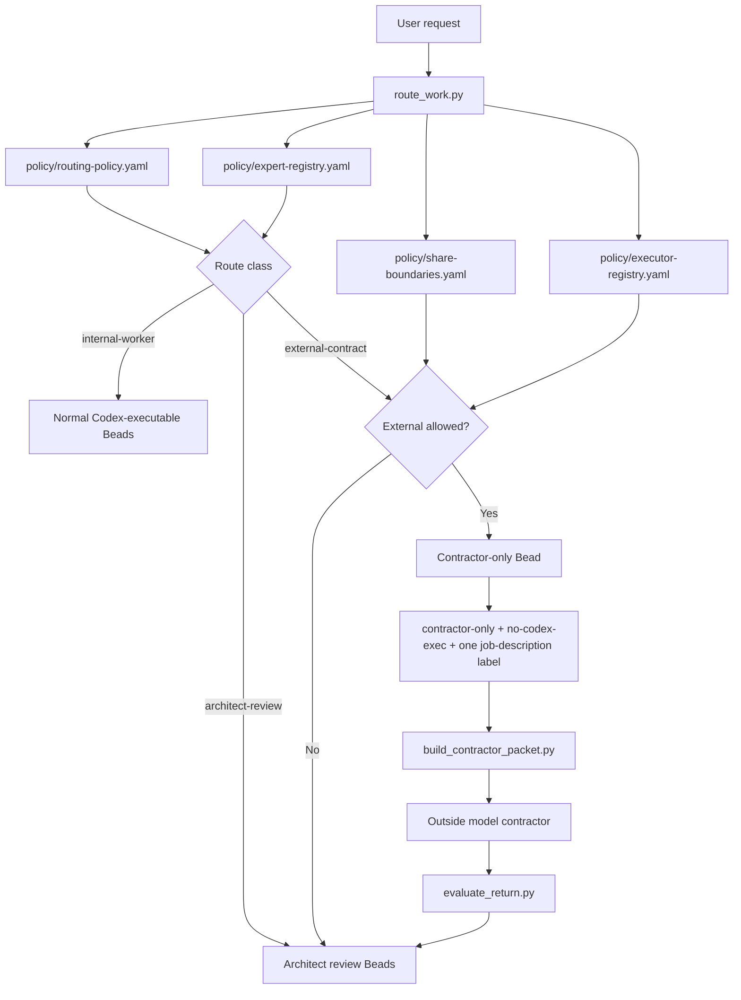
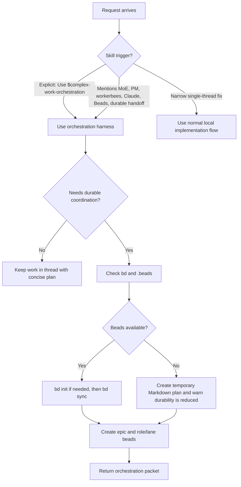
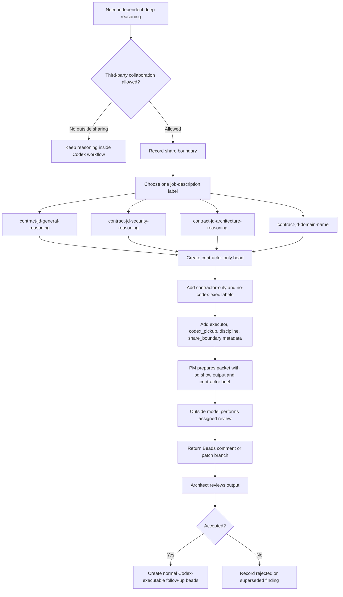
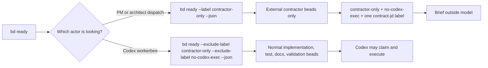

# Complex Work Orchestration

This skill turns complex work into a controlled operating model with a senior
architect, project-manager coordination, bounded Codex workerbees, optional
outside model contractors, and a Beads-backed work graph.

Use it when a project needs durable state, multiple agents, independent review,
external reasoning, or careful release judgment.

## Installation

Clone the repository and run the guided installer:

```bash
git clone https://github.com/gprocunier/complex-work-orchestration.git
cd complex-work-orchestration
./scripts/install.sh
```

The installer first autodetects your Codex skills directory from:

1. `CODEX_SKILLS_DIR`
2. `CODEX_HOME/skills`
3. `$HOME/.codex/skills`

When running interactively, it shows the detected path and lets you accept it or
type a different skills directory. For automation, pass the target explicitly:

```bash
./scripts/install.sh --skills-dir /path/to/codex/skills --yes
```

You can also point it at a Codex home:

```bash
./scripts/install.sh --codex-home /path/to/.codex --yes
```

The installer copies the skill files directly into the selected skills
directory: `README.md`, `LICENSE`, `SKILL.md`, `agents/`, `policy/`,
`templates/`, `experts/`, `references/`, and `scripts/`. It does not build or
require a tarball.

## Invocation

Use the explicit trigger when you want the full scaffold:

```text
Use $complex-work-orchestration to scaffold this project.
```

The skill should also be used for requests that mention:

- Mixture of Experts
- architect, project manager, or workerbee roles
- Claude, Opus, Mythos, or another outside contractor model
- Beads work graphs
- durable handoff or multi-session coordination
- broad review, release, lab, production, or publication risk

## Policy Control Plane

The skill is organized as a small control plane over Beads. The Markdown files
teach the operator-facing flow; the JSON-compatible YAML policy files make the
same flow inspectable by helper scripts without adding a Python dependency.

Core policy files:

- `policy/routing-policy.yaml`: route classes, restricted terms, default route,
  and contractor guard labels.
- `policy/executor-registry.yaml`: internal and outside executor capabilities,
  opt-in requirements, and Codex pickup rules.
- `policy/expert-registry.yaml`: discipline profiles, trigger terms,
  job-description labels, and expected output lenses.
- `policy/share-boundaries.yaml`: allowed third-party sharing modes and
  never-share categories.
- `policy/acceptance-policy.yaml`: contractor return sections and architect
  review rules.

Helper scripts:

- `scripts/route_work.py`: classify a request against the policy.
- `scripts/scaffold_workgraph.py`: create a policy-shaped Beads epic and lane
  tasks.
- `scripts/spawn_expert_reviews.py`: create expert-review or contractor-only
  Beads from routing triggers.
- `scripts/build_contractor_packet.py`: generate a gated outside-contractor
  packet for one Bead.
- `scripts/evaluate_return.py`: check contractor returns for required sections.
- `scripts/summarize_resume_state.py`: print Beads resume commands and current
  graph state.

Example route check:

```bash
python3 scripts/route_work.py \
  --external-ok \
  --share-boundary redacted-packet \
  "Security review the auth token and shell command handling."
```

## Diagrams

### Harness Structure


### Policy Routing



### Invocation Flow



### External Contracting Flow



### Beads Work Selection



## Operating Flow

1. Decide whether the work is small enough to stay in-thread or needs the
   orchestration harness.
2. Classify non-trivial work against the policy:

   ```bash
   python3 scripts/route_work.py "<task text>"
   ```

3. If outside contracting may help, ask the third-party collaboration question:

   ```text
   Should this project use a third-party model contractor for deep reasoning? If
   yes, what may be shared: redacted packet only, repo read-only, patch branch,
   or no outside sharing?
   ```

4. If the answer permits outside sharing, re-run the route with `--external-ok`
   and the selected `--share-boundary`.
5. Check Beads and initialize or sync the work graph.
6. Create one epic for the project goal.
7. Create role/lane tasks under the epic: architect framing, PM coordination,
   workerbee work, validation, docs/handoff, and any outside contracts.
8. For outside work, post contractor-only beads with job-description labels.
9. PM prepares the contractor packet and dispatches the outside model.
10. The outside model returns findings through Beads comments or a patch branch.
11. The architect reviews contractor findings before Codex workers implement
   follow-up work or before release decisions are made.
12. PM keeps dependencies, status, blockers, and resume instructions current.

## Beads Requirement

Beads is required for the full durable workflow. The installer warns if `bd` is
missing but does not fail, because the skill can still be read and used manually.

Use these checks at startup:

```bash
command -v bd
test -d .beads && bd ready --json || true
```

If the repo should own durable coordination and `.beads` is absent:

```bash
bd init
```

When a synced graph exists:

```bash
bd sync
```

If Beads is unavailable, create the same structure in a temporary Markdown plan
and say that durability is reduced. Do not claim contractor-only filtering,
shared ready-work semantics, or durable external handoff unless Beads or an
equivalent tracker is actually in use.

On Fedora or EPEL-style systems, use your configured Beads package source. If
you do not have one, the installer suggests the public `greg-at-redhat/beads`
COPR. Set `BEADS_COPR=owner/project` before running the installer to point the
hint at a different COPR.

Normal Codex ready-work discovery should exclude outside contracts:

```bash
bd ready --exclude-label contractor-only --exclude-label no-codex-exec --json
```

PM or architect dispatch can inspect contractor work explicitly:

```bash
bd ready --label contractor-only --json
bd show <id> --json
```

## External Contracting

Outside models are contractors, not project owners. They receive one explicit
bead at a time. They do not re-plan the project, close parent epics, publish,
release, tag, rotate secrets, or run destructive commands.

External contracting is fail-closed. A contractor packet is only valid when the
user has opted in, the selected share boundary allows outside work, the Bead has
`contractor-only` and `no-codex-exec`, and an architect review is required
before any finding becomes implementation work.

Use outside contracts for work that benefits from an independent reasoning lens:

- general second-opinion reasoning
- security-focused review
- architecture critique
- reliability or operations review
- performance analysis
- documentation and publishability review
- discipline-specific review such as SELinux, API compatibility, packaging, or compliance

The PM prepares the packet. The architect remains the final decision owner.

## Job Description Labels

Every outside contract gets guard labels:

- `contractor-only`
- `no-codex-exec`

Every outside contract also gets exactly one primary job-description label:

- `contract-jd-general-reasoning`: assumptions, tradeoffs, failure modes,
  alternatives, and independent critique.
- `contract-jd-security-reasoning`: threat model, privilege boundaries,
  input handling, authn/authz, secret exposure, dependencies, and supply-chain
  risk.
- `contract-jd-architecture-reasoning`: system boundaries, coupling,
  migration paths, data flow, maintainability, and reversibility.
- `contract-jd-reliability-reasoning`: operational failure modes, recovery,
  observability, rollout, concurrency, state, and incident risk.
- `contract-jd-performance-reasoning`: scaling behavior, algorithmic cost,
  resource pressure, hot paths, caching, and benchmark gaps.
- `contract-jd-docs-reasoning`: correctness, clarity, audience fit, missing
  warnings, examples, and publishability.
- `contract-jd-domain-<name>`: any other discipline-specific contract, such as
  `contract-jd-domain-selinux` or `contract-jd-domain-api-compat`.

The job-description label calibrates the outside model. A security contract
should return security findings, not a generic project review.

## Contractor Bead Template

```text
Purpose:
Scope:
Inputs:
Allowed changes:
Do not touch:
Expected output:
Validation required:
Escalation triggers:
Handoff format:
Contractor job description:
Contract labels:
Share boundary:
Codex handling rule:
```

Example:

```bash
bd create "Claude Opus review: security-focused reasoning for <scope>" \
  --type task \
  --labels contractor-only,no-codex-exec,contract-jd-security-reasoning \
  --assignee external-claude-opus \
  --metadata '{"executor":"external-llm","codex_pickup":"forbidden","job_description":"security-focused reasoning","discipline":"security","share_boundary":"redacted-packet","return_channel":"bd-comment","architect_review_required":true}' \
  --description "Purpose:
Scope:
Inputs:
Allowed changes:
Do not touch:
Expected output:
Validation required:
Escalation triggers:
Handoff format:
Contractor job description:
Contract labels:
Share boundary:
Codex handling rule: Codex agents may coordinate, brief, and review this bead, but must not execute or close it as contractor work."
```

## Contractor Packet

Give the outside model:

- the assigned bead ID and `bd show <id> --json` output
- `references/contractor-brief.md`
- the job-description label and discipline lens
- allowed files, forbidden files, and sharing boundary
- expected output and handoff format
- validation expectations
- escalation triggers

The packet can be generated after the contractor Bead exists:

```bash
python3 scripts/build_contractor_packet.py \
  --bead <id> \
  --executor external_security_reviewer \
  --share-boundary redacted-packet
```

Do not ask outside models for raw chain-of-thought. Ask for conclusions,
assumptions, evidence, alternatives considered, risks, confidence, and
recommended next actions.

## Return Format

Contractor results should come back as a Beads comment or a patch branch with a
Beads comment pointing to it:

```text
Status:
Contractor job description:
Summary:
Files changed:
Commands run:
Validation result:
Evidence:
Alternatives considered:
Confidence:
Risks or gaps:
Recommended next bead:
Escalation needed:
```

## Reference

See `references/external-contracting.md` for a more detailed operator guide.
Use `references/contractor-brief.md` as the reusable assignment brief for
outside model contractors.
Use `policy/`, `templates/`, and `experts/` as the source of truth for route
classification, job-description calibration, and reusable Beads bodies.

## License

This project is licensed under the GNU General Public License v3.0 only
(`GPL-3.0-only`). See `LICENSE`.
