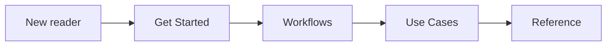
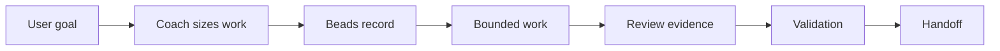
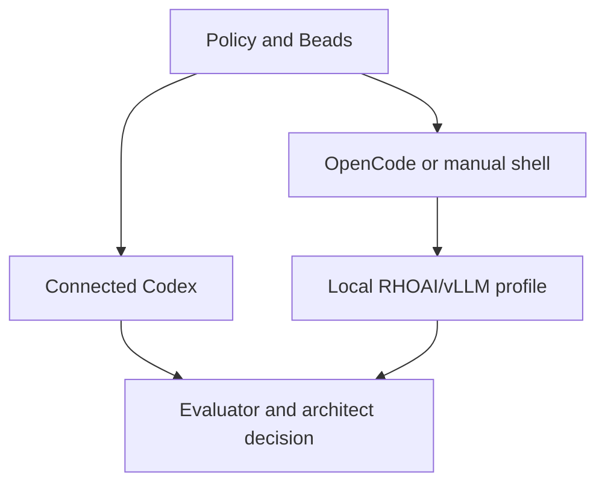

# Complex Work Orchestration

Complex Work Orchestration, or CWO, is a Codex skill, a local instruction pack
that Codex can load during a conversation, for AI-assisted work that needs more
structure than one long chat transcript.

If you have mostly used ChatGPT, Claude.ai, or Gemini in a browser, the key
shift is that coding-agent shells can work inside a real project. They can read
files, edit code, run commands, inspect failures, and verify results. CWO adds
the operating model around that power: durable memory, review boundaries,
validation evidence, and handoff.

Use CWO when the work needs any of these:

- A durable task record that survives session summarization, restart, or handoff.
- A clear plan before implementation.
- Independent review from another model or local worker.
- Evidence that external or local model output was evaluated before use.
- Validation and publication checks before pushing or releasing.

Beads is the durable task graph CWO uses to record scope, dependencies,
evidence, validation, closure rationale, and follow-up.

Project site: https://gprocunier.github.io/complex-work-orchestration/

Version: see `VERSION`. Release notes and breaking-change notes live in
`CHANGELOG.md`; no Git tag is implied by the working-tree version file.

## Start Here

The project site is organized as a crawl, walk, run path:

- **Crawl:** [Get Started](https://gprocunier.github.io/complex-work-orchestration/get-started.html)
  installs the skill and runs the smallest useful task.
- **Walk:** [Workflows](https://gprocunier.github.io/complex-work-orchestration/workflows.html)
  shows the end-to-end Codex path with Beads, validation, and handoff.
- **Run:** [Use Cases](https://gprocunier.github.io/complex-work-orchestration/use-cases.html)
  shows when to add review workers, outside reviewers, local workers, or
  publication gates.
- **Expert lane:** [Reference](https://gprocunier.github.io/complex-work-orchestration/reference.html)
  is the lookup surface for policies, schemas, experts, scripts, and validation
  gates.



## Install

Clone the repository and run the guided installer:

```bash
git clone https://github.com/gprocunier/complex-work-orchestration.git
cd complex-work-orchestration
./scripts/install.sh
```

The installer detects a Codex skills directory from:

1. `CODEX_SKILLS_DIR`
2. `CODEX_HOME/skills`
3. `$HOME/.codex/skills`

For unattended installs, pass the destination explicitly:

```bash
./scripts/install.sh --skills-dir /path/to/codex/skills --yes
```

Check an existing install without modifying it:

```bash
python3 scripts/check_installed_skill.py --check
```

If the checker reports `missing` or `drift`, rerun the installer against the
same skills directory.

CWO expects [Beads](https://github.com/gastownhall/beads) for durable task
tracking. The skill installer warns when `bd` is missing so the documentation
can still be installed and read.

```bash
command -v bd
bd version
```

## First Run

The normal interface is the Codex conversation. Start in plan mode when sizing
is unclear:

```text
/plan Use $complex-work-orchestration prompt coach:
Clean up installer docs, tests, and handoff notes.
```

For a narrow task, Codex can keep the work in the current thread, create one
Beads task, run validation, and close the task with recovery-quality notes. For
broader work, the coach can scaffold an epic with implementation, review,
validation, publication, and handoff workstreams.

For automation or troubleshooting, the same coach can be run directly:

```bash
python3 scripts/coach_prompt.py \
  "Clean up installer docs, tests, and handoff notes."
```

## What CWO Adds

CWO is not a replacement for Codex, Claude Code, Gemini CLI, OpenCode,
LangGraph, AutoGen, CrewAI, OpenRouter, or local model serving. It does not
replace those shells, model access points, or agent runtimes. CWO provides the
work control layer around them:

- **Memory:** Beads records scope, dependencies, evidence, closure rationale,
  and follow-up.
- **Routing:** policy chooses whether the work stays in-thread, needs a full
  graph, or needs a bounded evidence source such as an outside reviewer or
  local worker.
- **Review:** outside reviewers, local workers, and model synthesis are
  optional evidence sources, not implementation authority.
- **Validation:** tests, install checks, docs validation, publication checks,
  and handoff notes are recorded before acceptance.
- **Handoff:** the next agent can recover what changed, why it was accepted,
  how it was checked, and what remains.



## Connected And Disconnected Paths

The best-tested path is connected Codex: the main Codex thread plans, edits,
runs checks, and records evidence in Beads.

CWO is designed so the governance model can survive beyond one shell. Restricted
or disconnected environments can render bounded work envelopes for OpenCode or
a manual operator shell, then use approved local model endpoints such as
OpenShift AI vLLM through OpenAI-compatible profiles. In that path, local model
returns remain evidence until they are evaluated and accepted by the architect,
the CWO role that keeps final judgment.



See:

- [Local Workers](https://gprocunier.github.io/complex-work-orchestration/local-workers.html)
- [External Contracting](https://gprocunier.github.io/complex-work-orchestration/external-contracting.html)
- [Model Synthesis](https://gprocunier.github.io/complex-work-orchestration/model-synthesis.html)
- [Zero-Trust Consensus](https://gprocunier.github.io/complex-work-orchestration/zero-trust-consensus.html)

## Repository Map

- `SKILL.md` - Codex skill entry point and operating rules.
- `AGENTS.md` - repository-local Codex instructions.
- `scripts/` - coach, routing, dispatch, validation, install, and reporting
  helpers.
- `policy/` - JSON-compatible YAML registries for routing, providers,
  executors, experts, model profiles, share boundaries, and contracting
  controls.
- `schemas/` - JSON schemas for packets, returns, dispatch envelopes,
  readiness plans, reports, and continuation artifacts.
- `experts/` - calibrated review profiles used by internal and external lanes.
- `templates/` - reusable work packet, run readiness, and continuation shapes.
- `docs/` - GitHub Pages source.
- `references/` - operator deep dives linked from the public site.

## Validation

Before handoff, run the repository checks:

```bash
python -m compileall .
python scripts/validate_repository.py
python scripts/validate_public_copy.py
python -m unittest discover -s tests -v
./scripts/install.sh --skills-dir /tmp/cwo-skill-test/skills --yes --dry-run
```

For documentation changes, also run:

```bash
python scripts/generate_site.py --check
python scripts/validate_public_copy.py
python scripts/validate_site.py
```

## License

GPL-3.0. See `LICENSE`.
