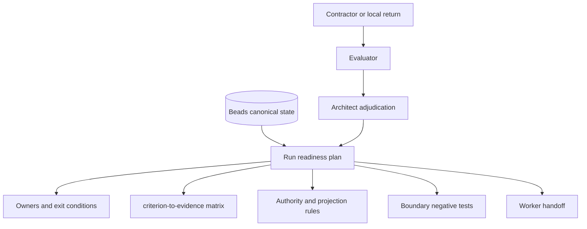
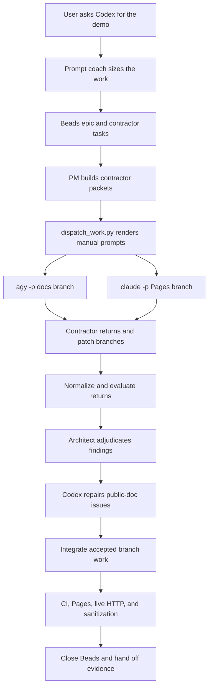
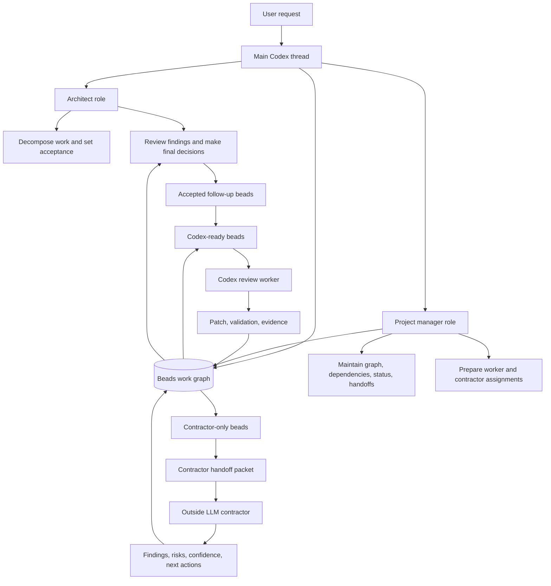
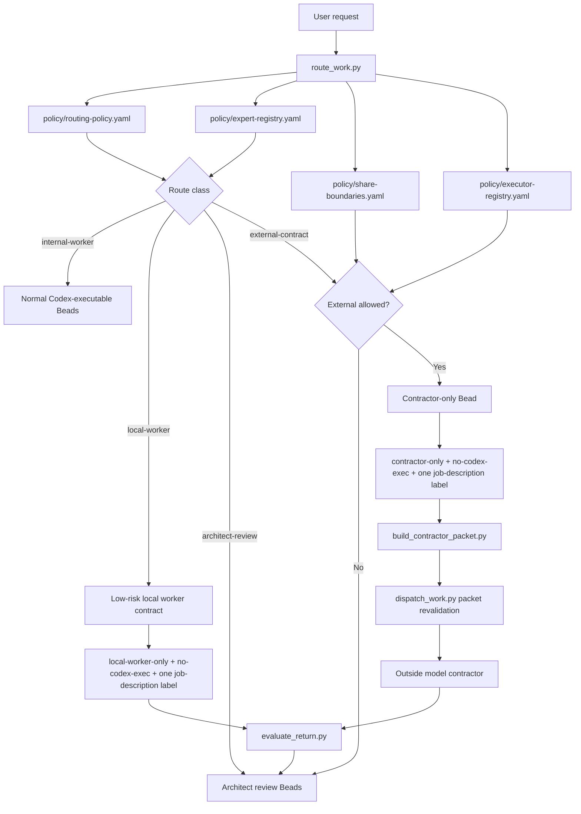
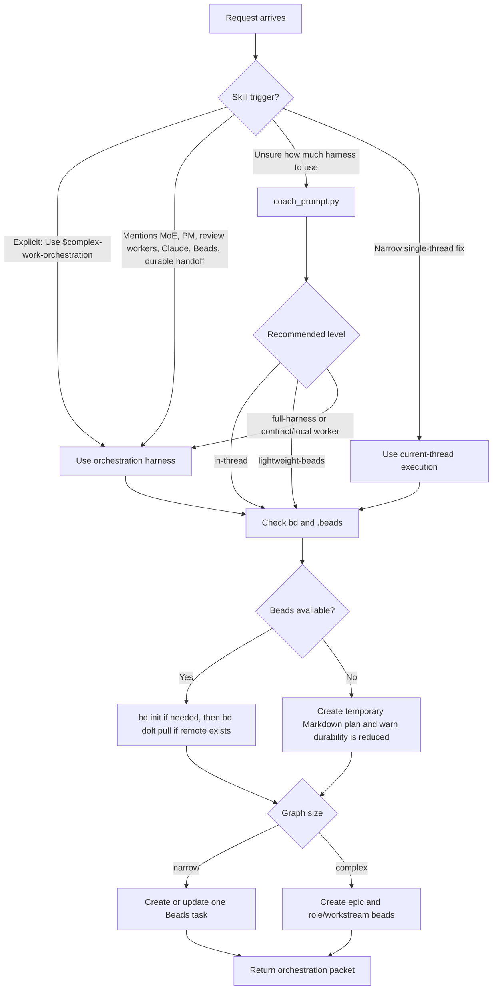
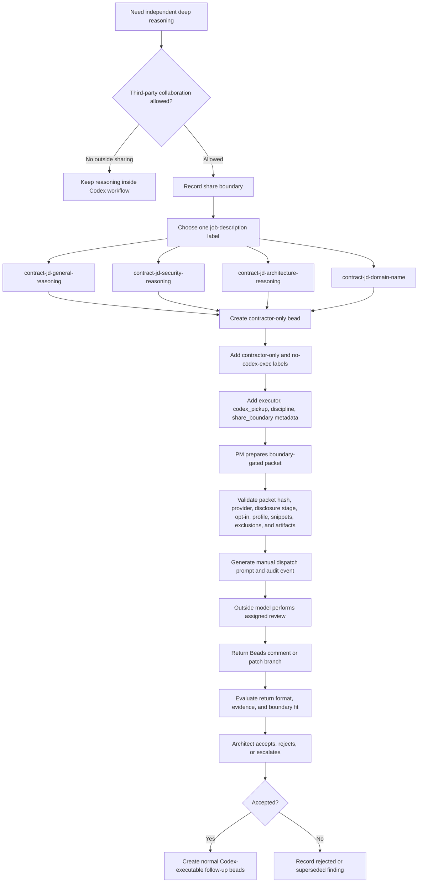
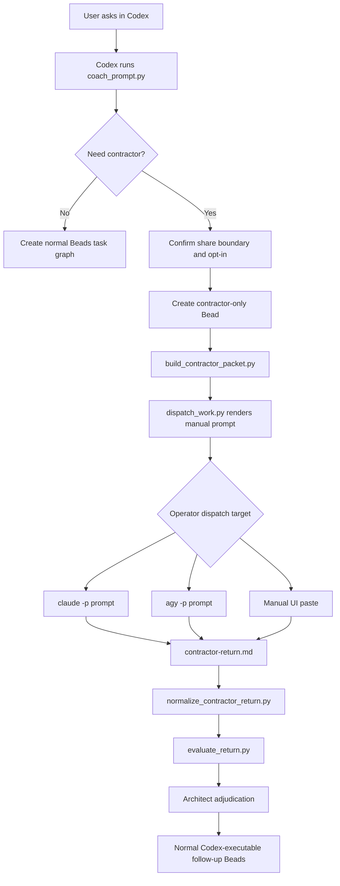
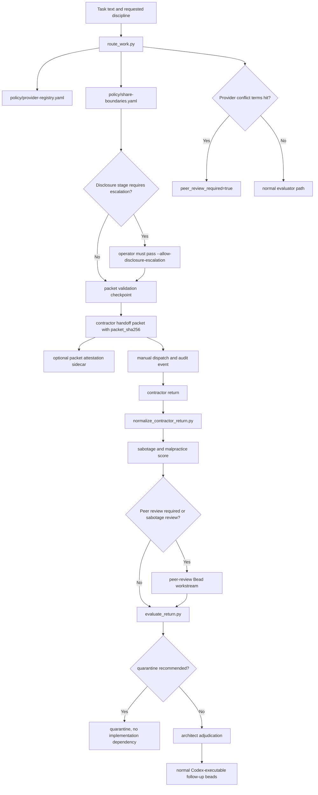
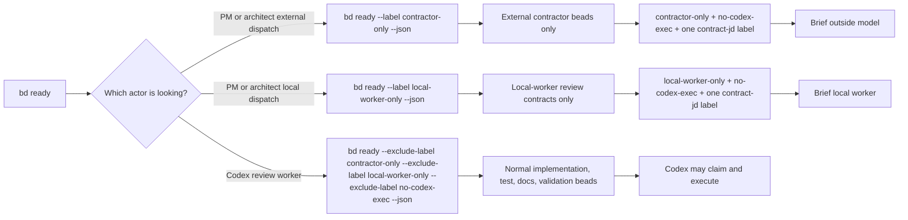
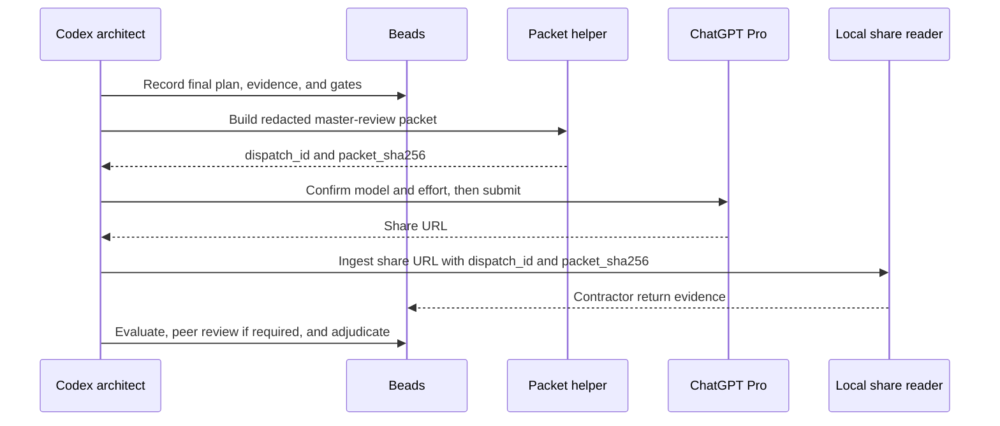

# Complex Work Orchestration

This skill keeps complex AI-assisted work from disappearing into one long
transcript. It gives Codex a controlled operating model with a senior
architect, project-manager coordination, bounded review workers, optional
outside model contractors, and a Beads-backed task graph.

Use it when a project needs durable memory, multiple agents, independent
review, external or local model evidence, or careful release judgment.

Project site: https://gprocunier.github.io/complex-work-orchestration/

Version: see `VERSION`. Release notes and breaking-change notes live in
`CHANGELOG.md`; no Git tag is implied by the working-tree version file.

Start with Get Started when you are using the skill interactively:

- Get Started: https://gprocunier.github.io/complex-work-orchestration/get-started.html
- Workflows: https://gprocunier.github.io/complex-work-orchestration/workflows.html
- Explanation: https://gprocunier.github.io/complex-work-orchestration/explanation.html
- Reference: https://gprocunier.github.io/complex-work-orchestration/reference.html

## Installation

Clone the repository and run the guided installer:

```bash
git clone https://github.com/gprocunier/complex-work-orchestration.git
cd complex-work-orchestration
./scripts/install.sh
```

The installer first autodetects your Codex skills directory from:

1. `CODEX_SKILLS_DIR`
2. `CODEX_HOME/skills`
3. `$HOME/.codex/skills`

When running interactively, it shows the detected path and lets you accept it or
type a different skills directory. For automation, pass the target explicitly:

```bash
./scripts/install.sh --skills-dir /path/to/codex/skills --yes
```

You can also point it at a Codex home:

```bash
./scripts/install.sh --codex-home /path/to/.codex --yes
```

The installer copies the skill files directly into the selected skills
directory: `README.md`, `LICENSE`, `SKILL.md`, `AGENTS.md`, `VERSION`,
`CHANGELOG.md`, `agents/`, `policy/`, `templates/`, `experts/`,
`references/`, `schemas/`, `examples/`, `docs/`, and `scripts/`. It does not
build or require a tarball. After copying, it compares a content manifest for
the source checkout and installed skill, writes `.cwo-install-manifest.json`
inside the installed skill, and fails the install if the copied content is
already drifted.

Check an existing install without modifying it:

```bash
python3 scripts/check_installed_skill.py --check
```

If the checker reports `missing` or `drift`, reload the skill by rerunning the
installer against the same skills directory:

```bash
./scripts/install.sh --skills-dir /path/to/codex/skills --yes
```

## First Run

The fastest useful path is an in-Codex prompt, one Beads record, and a
validation note:

```text
/plan Use $complex-work-orchestration prompt coach:
Clean up installer docs, tests, and handoff notes.
```

Codex uses the coach to size the work before execution. For a narrow task it
can stay in the current thread and create one Beads task. For broader work it
can scaffold an epic, ask about subagent parallelism, select the Beads context
depth, and add validation or publish gates. Outside contractors and local
workers are opt-in evidence lanes; their returns are evaluated before the
architect accepts any finding.

For a first pass, verify:

```bash
command -v bd
bd ready --json || true
python3 scripts/check_installed_skill.py --check
```

Then let Codex record validation evidence and close the Bead with a short
reason plus a final closure-memory comment. The detailed command reference
lives later in this README and on the project site.

## Invocation

The normal interface is the Codex conversation. When sizing is unclear, start
in Plan mode and ask Codex to use the skill and prompt coach:

```text
/plan Use $complex-work-orchestration prompt coach:
Clean up installer docs, tests, and handoff notes.
```

Use the explicit scaffold trigger when you already know the work needs the full
architect/PM/worker harness:

```text
Use $complex-work-orchestration to scaffold this project.
```

For a full external review chain, keep the prompt short and outcome-focused:

```text
/plan Use $complex-work-orchestration prompt coach: have Claude Opus and Gemini critique the architect plan, then use ChatGPT Pro 5.5 Extended Reasoning for master review before implementation.
```

The prompt coach treats explicit scaffold language as a full-harness request.
If the work needs a focused review chain instead of broad expert fan-out, say
`tight-chain review` in the prompt coach or use `--scaffold-size tight` when
running the scaffold helper. Public docs call bounded helpers review workers or
subagents; internal routing terms still work when you are using the operator
reference. Contractor workstream language asks for the outside-sharing boundary
before any external dispatch.

Codex may run the helper behind the scenes. Use direct script execution only
for automation, CI, troubleshooting, or an operator shell outside Codex:

```bash
python3 scripts/coach_prompt.py \
  "Clean up installer docs, tests, and handoff notes."
```

When the user has accepted a recommended synthesis lane, advanced helpers use
the same activation flag at each stage:

```bash
python3 scripts/coach_prompt.py --model-synthesis "<task text>"
python3 scripts/route_work.py --model-synthesis "<task text>"
python3 scripts/scaffold_workgraph.py --title "<goal>" --description "<scope>" --model-synthesis
```

For focused review work, keep the graph compact while preserving required gates:

```bash
python3 scripts/coach_prompt.py --scaffold-size tight "<task text>"
python3 scripts/scaffold_workgraph.py --title "<goal>" --description "<scope>" --scaffold-size tight
```

For advanced automation, the coach and route helpers also expose Beads
context-depth overrides. Normal in-Codex use should let the coach size this and
surface the Plan-mode choice only when it matters:

```bash
python3 scripts/coach_prompt.py --beads-context-depth focused "<task text>"
python3 scripts/build_beads_brief.py --bead <id> --depth focused --for subagent
```

Simple use case:

1. Start with `/plan Use $complex-work-orchestration prompt coach:`.
2. Let Codex ask the few choices that change execution, such as harness size,
   review parallelism, sharing boundary, and validation bar.
3. Keep narrow work in the main thread when that is enough, but create or update
   one Beads task before execution.
4. Record validation evidence in the Bead before accepting the change.
5. Close meaningful work with a closure-memory comment that lets the next agent
   recover the outcome without the full transcript.

All work governed by this skill should leave a durable Beads story. A narrow
task can still execute in the current thread, but the minimum tracking shape is
one Beads task with evidence, validation, and handoff notes.
Generated Beads should populate the native Beads fields for `skills`,
`acceptance`, `design`, and `notes`; descriptions remain the human-readable
assignment body.

## Run Readiness Gate

Use a run readiness plan before worker handoff when the run has broad
implementation scope, contractor or local-worker evidence, model synthesis, or
public/release risk. The plan proves that the work is ready to execute; it does
not replace the Beads graph.

The readiness gate is the place to define done before workers execute: owners,
exit conditions, a criterion-to-evidence matrix, rubric version, projection
authority, typed next-version follow-up, and handoff evidence. The first-class
projection types are `run-sheet`, `wrap-up-status`, and `next-version`; each
declares Beads as the canonical source and a renderer command or source Bead.
Run sheets and wrap-up/status reports are generated views from durable Beads
state; they are not new authority.

Use the JSON shape when automation needs a hard gate, then render projection
views when humans need a run sheet, wrap-up, or next-version rail:

```bash
python3 scripts/validate_run_readiness_plan.py examples/sample-run-readiness-plan.json
python3 scripts/render_run_projection.py examples/sample-run-readiness-plan.json --projection run-sheet
python3 scripts/render_run_projection.py examples/sample-run-readiness-plan.json --projection wrap-up-status
```

Deferred work must use one of the allowed next-version reason types:
`out-of-scope`, `needs-credential`, `needs-research`, `hardening`,
`later-version`, or `blocked`. Patrol or recurring work remains research-only
until `ownership`, `locking`, `history`, `failure_containment`, and
`provider_neutral_execution` are accepted.

Reference files:

- `references/run-readiness.md`
- `templates/run-readiness-plan.md`
- `schemas/run-readiness-plan.schema.json`
- `examples/sample-run-readiness-plan.json`
- `scripts/validate_run_readiness_plan.py`
- `scripts/render_run_projection.py`



## Where CWO Fits

CWO is a governance, evidence, and handoff layer for Codex-led work. It does
not replace OpenRouter Fusion, LangGraph, AutoGen, CrewAI, Claude Code, Gemini
CLI, or Codex CLI. Those tools remain the model, runtime, coding-agent, or
workflow surfaces. CWO decides when a surface is appropriate, records the
approved share or local-execution boundary, evaluates the return, and preserves
the result in Beads.

The operating model is bring-your-own-subscription (BYOS) or bring-your-own-key
(BYOK):
provider accounts, OpenRouter keys, ChatGPT Pro browser sessions, Claude or
Gemini CLI credentials, Codex access, and OpenShift AI vLLM endpoints stay with
the operator. CWO records opt-in, provenance, dispatch IDs, packet hashes,
return evaluation, closure rationale, residual risk, and follow-up. OpenShift
AI vLLM is treated as a local-worker profile through an OpenAI-compatible
endpoint, and local output still needs evaluator plus architect adjudication.

## Execution Environments

Codex CLI is the current default execution environment, but CWO is not meant to
be permanently hard-coupled to one shell. The v2 execution-environment model
separates CWO governance from the harness that performs bounded work. CWO keeps
Beads, routing, packet validation, return evaluation, architect adjudication,
validation, and handoff. A harness such as Codex CLI, OpenCode, or a manual
operator shell runs only the assignment CWO renders for it.

The control-plane files are:

- `policy/harness-registry.yaml`
- `policy/execution-environments.yaml`
- `policy/model-profiles.yaml`
- `schemas/execution-environment.schema.json`
- `schemas/harness-dispatch-envelope.schema.json`
- `schemas/model-profile.schema.json`
- `schemas/run-readiness-plan.schema.json`
- `references/execution-environments.md`
- `references/run-readiness.md`

`policy/model-profiles.yaml` is the RedHatAI-first role substitution matrix for
local RHOAI/vLLM execution. It compares the connected defaults CWO currently
expects, such as the Codex 5.5 x-high architect, a simpler PM/coordination
model, and Codex 5.3 Spark workerbees, with public Hugging Face models that can
be served behind OpenShift AI vLLM. The comparison is a deployment starting
point, not a claim that an open model has proprietary frontier parity.

### Airgapped Model Matrix

| CWO role | Connected default | Practical airgapped profile | Enterprise evaluation targets | Boundary |
| --- | --- | --- | --- | --- |
| Architect | Codex 5.5 x-high architect | `rhoai-architect-mistral-small-4-119b-nvfp4` | <ul><li><code>rhoai-architect-nemotron-3-ultra-550b-a55b-fp8</code></li><li><code>rhoai-architect-glm-5-2-fp8</code></li></ul> | Strong local planning candidates; benchmark before promotion. |
| Project manager | Codex main-thread PM or smaller coordination model | `rhoai-project-manager-qwen3-6-35b-a3b-nvfp4` | <ul><li><code>rhoai-architect-glm-5-2-fp8</code> for summarization-heavy workloads</li></ul> | Use for dependencies, status, and handoff drafting. |
| Workerbee | Codex 5.3 Spark | `rhoai-worker-qwen2-5-coder-32b-fp8` | <ul><li><code>rhoai-architect-glm-5-2-fp8</code> for large reasoning packets</li></ul> | Use for bounded code review, test triage, and patch proposal drafting. |
| Review worker | Codex 5.3 Spark review-only subagent | `rhoai-reviewer-nemotron-3-nano-30b-fp8` | <ul><li><code>rhoai-reviewer-llama-4-maverick-17b-128e-fp8</code></li><li><code>rhoai-architect-nemotron-3-ultra-550b-a55b-fp8</code></li></ul> | Use the larger lanes only for multimodal or high-stakes review. |
| Local secure reviewer | Local secure reviewer or Codex evaluator | `rhoai-secure-review-qwen3-6-35b-a3b-nvfp4` | <ul><li><code>rhoai-architect-nemotron-3-ultra-550b-a55b-fp8</code> for high-stakes local review</li></ul> | Read-only review evidence; no shell, web, or repo write. |
| Synthesis input | CWO-native synthesis with architect adjudication | `rhoai-synthesis-qwen3-5-122b-a10b-nvfp4` | <ul><li><code>rhoai-architect-nemotron-3-ultra-550b-a55b-fp8</code></li><li><code>rhoai-architect-glm-5-2-fp8</code></li></ul> | Local synthesis input only; CWO still owns provenance and final synthesis. |

The practical defaults are the reasonable starting point for disconnected
deployments. Enterprise evaluation targets are opt-in benchmark targets for
larger disconnected clusters, not silent defaults. The benchmark gate is the
promotion line: promote Nemotron 3 Ultra or GLM-5.2 only after recording GPU
topology, P2P/NCCL behavior, vLLM startup flags, `/v1/models` and
`/v1/chat/completions` smoke tests, representative CWO architect/synthesis
packets, evaluator scoring, and architect adjudication. Llama 4 Maverick is
documented as a multimodal or general-review lane, not as the primary x-high
architect replacement.

OpenCode is the first v2 open-source exemplar because it is terminal-first,
scriptable, provider-flexible, and can target local OpenAI-compatible model
serving. In restricted or airgapped environments, the profile can bind work to
OpenCode plus OpenShift AI vLLM or another approved local endpoint while
external contracting stays disabled unless the environment policy explicitly
allows it. Airgapped profiles should also say plainly when Beads are local-only
and no Dolt remote sync is available.

Render a non-executing dispatch envelope for an OpenCode lane:

```bash
python3 scripts/render_harness_dispatch.py \
  --environment airgapped-rhoai \
  --role worker \
  --model-profile rhoai-worker-qwen2-5-coder-32b-fp8 \
  --json \
  "Review command examples for execution environment wording."
```

The renderer does not run OpenCode. It produces a versioned prompt envelope
with lifecycle state `rendered`, prompt hash, capability requirements,
constraints, selected `model_profile`, sanitized model profile details,
suggested command, timeout, and harness metadata so an operator or future
adapter can execute under the selected environment boundary. If the role has a
model profile in `policy/execution-environments.yaml`, the renderer resolves it
automatically. Use `--model-profile` for an explicit approved profile or
`--model` for an operator override; the two flags are mutually exclusive.

Non-trivial closed Beads should also receive a final closure-memory comment
before `bd close`. Keep `close_reason` short; put reusable context in the
comment. The comment should answer:

- Who was involved: agent, reviewer, operator, model lane, or team.
- What changed: files, behavior, or workstream result.
- Why closed: disposition and rationale.
- How validated: commands, review evidence, CI, install smoke, or manual checks.
- When closed: branch, commit, run ID, date, or other timeline marker.
- Where executed: repo path, branch, environment, and Beads mode such as
  local-only or Dolt-backed.
- Residual risk and follow-up: anything the next agent should not rediscover.

This lets a spawned agent with no transcript, or a compacted session with fuzzy
memory, rehydrate what happened without guessing from git history alone. The
helper supports repeatable `--who`, `--decision`, `--evidence`,
`--residual-risk`, and `--follow-up` flags; use `--meaningful` when those
recovery fields should be enforced instead of linted.

When creating Beads manually, do not type literal `\n` sequences into text
fields. Use real newlines through a heredoc, `--body-file`, `--design-file`, or
shell command substitution so rendered Beads do not show backslash-n text.

The skill should also be used for requests that mention:

- Mixture of Experts
- architect, project manager, or review worker roles
- Claude, Opus, Mythos, ChatGPT Pro, or another outside contractor model
- Beads task graphs
- durable handoff or multi-session coordination
- broad review, release, lab, production, or publication risk

## Complex Multi-Expert Review Pattern

Use the complex pattern when a Codex architect plan needs independent critique
before implementation or publication. The public narrative name is a
multi-expert review pattern; the operator surface may still use Mixture of
Experts, contractor labels, executor IDs, and packet hashes.

Default sequence:

1. Codex drafts the architect plan and records the Beads graph.
2. The user explicitly approves third-party sharing and chooses a boundary,
   usually `redacted-packet` for plan critique.
3. PM creates separate contractor-only Beads for Gemini and Claude Opus
   architecture critique, one review focus per Bead.
4. The packet builder emits one attested packet per reviewer; dispatch IDs and
   packet SHA values are recorded before any return is accepted.
5. Gemini and Claude Opus return evidence only. Codex normalizes, evaluates,
   and the architect adjudicates each finding before it can become follow-up
   work.
6. ChatGPT Pro 5.5 Extended Reasoning can then review the final plan bundle as
   a master-review lane. That return is valid only with confirmed model
   attestation, matching dispatch ID, matching packet SHA, and a valid share
   link.
7. Accepted findings update the plan; rejected, unsupported, boundary-breaking,
   or wrong-model returns are recorded and ignored or quarantined.
8. Implementation, validation, publish sanitization, push, CI, Pages, and final
   closure-memory comments remain Codex-owned.

The detailed operator commands live in the external-contracting and reference
docs. Do not treat a contractor return as implementation authority, even when
the model is stronger or slower than the main thread.

## Hello-World Contractor Demo

The public
[hello-world-contractor-demo](https://github.com/gprocunier/hello-world-contractor-demo)
repository is a concrete case study for the Codex PM contractor workflow. The
published demo site is at
https://gprocunier.github.io/hello-world-contractor-demo/.

The important lesson is that outside tools are dispatch targets, not project
owners. Codex creates the Beads work graph, posts one bounded contract per
outside tool, renders manual prompts, evaluates returns, repairs or rejects
findings, integrates accepted patch-branch work after review, validates
publication, and records the handoff evidence.



Practical findings from the demo are now documented in the Pages case study at
`docs/contractor-demo.html`:

- start the demo from an in-Codex `/plan Use $complex-work-orchestration prompt coach ...`
  request so the coach can ask about outside sharing, subagent parallelism, and
  validation before execution
- packet generation is not dispatch; the helper renders a prompt for an
  operator-run `agy -p`, `claude -p`, or manual UI call
- the Codex runtime account must be able to run the approved contractor CLIs,
  or have operator-approved privilege escalation to an account that can; this
  is environment setup, not authority granted by the contractor packet
- use one contractor Bead and one patch branch per outside tool
- keep packet JSON, rendered prompts, and contractor returns ignored unless
  intentionally sanitized for publication
- external contractor output is evidence until Codex evaluates it and the
  architect accepts it
- public documentation needs explicit checks for local paths, `file://` links,
  provider attribution errors, and fabricated validation claims
- Beads may be local-only when no Dolt remote is configured; say that plainly
  instead of claiming sync

## Policy Control Plane

The skill is organized as a small control plane over Beads. The Markdown files
teach the operator-facing flow; the JSON-compatible YAML policy files make the
same flow inspectable by helper scripts without adding a Python dependency.

Core policy files:

- `policy/routing-policy.yaml`: route classes, restricted terms, default route,
  and contractor guard labels.
- `policy/executor-registry.yaml`: internal and outside executor capabilities,
  provider bindings, opt-in requirements, and Codex pickup rules.
- `policy/provider-registry.yaml`: provider trust tiers, retention classes,
  conflict-risk domains, and provider-family metadata.
- `policy/expert-registry.yaml`: discipline profiles, trigger terms,
  job-description labels, and expected output lenses.
- `policy/share-boundaries.yaml`: allowed third-party sharing modes and
  never-share categories, including disclosure-stage escalation rules.
- `policy/peer-review-policy.yaml`: when outside or local contract results need
  independent peer review before evaluation.
- `policy/acceptance-policy.yaml`: contractor return sections, sabotage and
  malpractice scoring thresholds, quarantine, and architect review rules.
- `policy/contracting-controls.yaml`: dispatch, audit, and adjudication
  controls for outside or local-worker contracts.

Public documentation and GitHub Pages work has an additional editorial review.
When the route sees public docs, README/install docs, GitHub Pages, site flow,
or documentation-architecture work, it selects the documentation expert,
web-design expert when a site/page is involved, and the editor expert. The
editor is the final reader-facing acceptance check before publish sanitization:
public copy should explain the workflow, prerequisites, and rationale without
exposing internal planning labels as product language.

Advanced helper scripts:

These are the implementation tools Codex can run in the workspace and the
shell equivalents for automation or CI. They are not the first-class
public user flow; start with `/plan` plus the skill when working interactively.
A contractor handoff packet is a policy-checked brief that contains the
approved share boundary, job labels, task context, selected snippets, provider
binding, and expert profile for outside or local review.

- `scripts/coach_prompt.py`: compile a right-sized invocation prompt before
  launching the full harness, including bounded `interactive_questions` that
  Codex can map to selectable Plan-mode prompts and a
  `beads_tracking_required` flag that is always true for skill-governed work.
- `scripts/route_work.py`: classify a request against the policy.
- `scripts/build_beads_brief.py`: build an internal Beads context brief for the
  main thread or subagents. `none` performs no `bd` lookup, `summary` reads the
  assigned Bead without comments, and `focused`, `heavy`, or `audit` may include
  Beads comments as internal evidence. `--for contractor` fails closed for
  comment-bearing depths; use `build_contractor_packet.py` for outside models.
- `scripts/cleanup_stale_agents.py`: automatically clean stale harness-owned
  agent sessions before launch while protecting the current Codex process tree;
  run it from the target workspace or pass `--workspace-root <path>`, and use
  `--terminate-unowned-codex` only for explicit operator cleanup of stale
  unowned Codex, Claude, or Agy processes in that workspace.
- `scripts/close_bead_with_summary.py`: add a final closure-memory comment
  with disposition, why, decisions, evidence, residual risk, and follow-up;
  pass `--close` only when the helper should also run `bd close`.
- `scripts/scaffold_workgraph.py`: create a policy-shaped Beads epic and workstream
  tasks; use `--dry-run --format beads-graph` to emit a `bd create --graph`
  compatible JSON plan for validation or advanced automation.
- `scripts/spawn_expert_reviews.py`: create expert-review or contractor-only
  Beads from routing triggers.
- `scripts/build_contractor_packet.py`: generate a gated outside-contractor
  packet for one Bead, with structured opt-in, quota checks, safe snippets,
  default audit recording, and a Distinguished Engineer profile included by
  default.
- `scripts/generate_manual_dispatch_prompt.py`: turn an approved packet into a
  manual prompt for Claude, Gemini, OpenAI deep research, or another contractor.
- `scripts/dispatch_work.py`: revalidate a contractor handoff packet, record a manual
  dispatch event by default, and produce the prompt without claiming that an
  external model was called automatically. Direct dispatch can use
  `--dispatch-id` so quota checks, output, and audit records share the same
  identity.
- `scripts/chatgpt_browser_review.py`: opt-in browser dispatch for a redacted
  master-plan review with `chatgpt_pro_5_5_extended_reasoning_browser`.
  Configure it with `CWO_CHATGPT_BROWSER_CONFIG`; keep the config outside the
  repository with operator-managed browser authentication and mode `0600`.
- `scripts/ingest_chatgpt_share_return.py`: read the resulting ChatGPT share
  link through the local `chatgpt-share-local-reader` skill and render a
  contractor-return template for evaluation.
- `scripts/check_installed_skill.py`: compare this checkout with the installed
  Codex skill using a content manifest; use `--check` to fail on missing or
  drifted installs and rerun `scripts/install.sh` to reload.
- `scripts/workspace_mutation_guard.py`: snapshot and compare tracked git state
  around tool-running external CLIs so unexpected checkout mutation becomes
  evaluation evidence instead of an unnoticed side effect. Pass
  `--include-untracked` when newly created untracked files should also block
  acceptance.
- `scripts/evaluate_return.py`: check contractor returns for required sections,
  sabotage or malpractice signals, peer-review disposition, and optional
  workspace mutation reports.
- `scripts/normalize_contractor_return.py`: turn a contractor response into a
  normalized return bundle with evidence items, sabotage scoring, and optional
  workspace mutation metadata.
- `scripts/dispatch_work.py --local-profile openshift-ai-vllm`: prepare a
  local OpenAI-compatible dispatch envelope for OpenShift AI vLLM or another
  named local profile. The envelope shape is documented by
  `schemas/local-dispatch-envelope.schema.json`.
- `scripts/verify_attestation.py`: verify SHA-256 subject attestations for
  packets, return bundles, or other exported artifacts.
- `scripts/verify_audit_log.py`: verify audit event hashes and hash-chain links.
- `scripts/record_audit_event.py`: append a local audit entry for routing,
  packet, dispatch, evaluation, and adjudication events. New entries include a
  previous-event hash when a prior event exists.
- `scripts/summarize_resume_state.py`: print Beads resume commands and current
  graph state.
- `scripts/validate_run_readiness_plan.py`: validate the run readiness plan
  before worker handoff, including owners, exit conditions, evidence mapping,
  authority rules, typed projections, quarantine handling, boundary negative
  tests, and handoff evidence.
- `scripts/render_run_projection.py`: render non-authoritative run sheet,
  wrap-up/status, or next-version projections from a validated readiness plan.
- `scripts/validate_repository.py`: fail CI when policies, schemas, personas,
  executor controls, or emitted packet artifact names drift apart.

Schemas in `schemas/` describe prompt-coach results, route results, contractor
packets, contractor return bundles, local dispatch envelopes, attestations,
acceptance decisions, run readiness plans, Beads metadata, and audit events.
`examples/` contains small sample artifacts that can be used as smoke-test
inputs.

Example route check:

```bash
python3 scripts/route_work.py \
  --external-ok \
  --share-boundary redacted-packet \
  "Security review the auth token and shell command handling."
```

## Diagrams

### Harness Structure



### Policy Routing



### Invocation Flow



### External Contracting Flow



### Main-Thread PM Dispatch Flow



### Provider Integrity And Quarantine



### Beads Work Selection



## Operating Flow

1. Decide whether the work is small enough to execute in-thread or needs the
   full orchestration harness. Beads tracking is mandatory either way. If
   unsure, ask Codex to run the prompt coach first:

   ```text
   /plan Use $complex-work-orchestration prompt coach:
   <task text>
   ```

   Codex may run this helper behind the scenes. Direct script execution is the
   advanced automation or troubleshooting equivalent:
   `python3 scripts/coach_prompt.py "<task text>"`.

   The coach returns a recommended orchestration level,
   `beads_tracking_required=true`, `scaffold_sizing`,
   `workerbee_parallelism`, `model_synthesis`, missing questions, bounded
   `interactive_questions`, enabled/disabled levers, warnings, and a
   paste-ready launch prompt. In Plan mode, use
   `interactive_questions` for selectable user input when the answer changes
   execution behavior. The coach always asks whether to parallelize with
   subagents. If the coach recommends
   `review-subagents` or `heavy-review-subagents`, use Codex 5.3 Spark when
   available, or the smallest available capable review model, for parallel
   docs, terminology, web-design, tests, routing, validation, or
   publish-sanitization review. In Default mode, ask only the required concise
   question or apply the coach's safe default.
   `model_synthesis` is separate from workerbee parallelism: explicit fusion,
   synthesis, ensemble, model-camp, or "more eyes" language sets
   `recommended_mode=requested` and activates a CWO-native synthesis lane.
   High-risk architecture, provider-conflict, or creative design signals set
   `recommended_mode=recommended` and require user opt-in before the lane is
   active. Accepted opt-in sets `recommended_mode=accepted`. Synthesis preserves
   independent returns, records consensus and disagreements, carries evaluator
   dispositions for partial/missing/rejected inputs, and still requires
   architect adjudication.
   Gemini/Agy architecture critique is salvage-only by default: it can supply
   useful risk notes and alternate framing, but it does not count toward
   `minimum_usable_inputs` for synthesis readiness unless the architect
   explicitly upgrades a specific evaluated finding. Evaluated returns expose
   `evidence_quality_score`, evidence-quality signal categories, and the
   acceptance decision's advisory `recommended_synthesis_use` so generic or
   low-signal advice is visible. Synthesis remains the authority for primary,
   salvage-only, open-risk, rejected, quarantined, and readiness classification.
   `scaffold_sizing` is the graph-size lever. Full graph remains the default
   for broad orchestration. Tight-chain sizing keeps the architect, PM,
   implementation, validation, docs/handoff, required peer/editor/evaluation
   gates, the primary review expert, and explicit architecture-critic
   contracts, while limiting optional secondary expert lanes.
   `beads_context_depth` and the compatibility alias `beads_briefing_depth`
   control how much durable Beads history internal Codex agents read. Values
   are `none`, `summary`, `focused`, `heavy`, and `audit`. Each result carries
   `beads_context_depth_provenance` with computed depth, effective depth,
   source, override field, and reason. The coach always includes the
   Beads context-depth choice in `interactive_questions`, with the autosized
   depth as the recommended default.
2. Classify non-trivial work against the policy:

   ```bash
   python3 scripts/route_work.py "<task text>"
   ```

3. If outside contracting may help, ask the third-party collaboration question:

   ```text
   Should this project use a third-party model contractor for deep reasoning? If
   yes, what may be shared: redacted packet only, repo read-only, patch branch,
   or no outside sharing?
   ```

4. If the answer permits outside sharing, re-run the route with `--external-ok`
   and the selected `--share-boundary`.
5. If using local inference, pass `--local-ok`; add `--prefer-local` only when
   low-risk local work is the desired route. Local-worker review beads still get
   `local-worker-only` and `no-codex-exec` and require evaluator plus architect
   adjudication before implementation. Use `--local-profile openshift-ai-vllm`
   when the target worker is an OpenShift AI vLLM endpoint.
6. Before launching agents, run stale-agent cleanup:

   ```bash
   python3 scripts/cleanup_stale_agents.py --json
   ```

   This automatically cleans harness-owned stale sessions while protecting the
   current Codex process tree. Run it from the target workspace, or pass
   `--workspace-root <path>` when Codex was launched from a broader parent
   directory. Broader cleanup of stale unowned Codex, Claude, or Agy processes
   requires explicit operator intent:

   ```bash
   python3 scripts/cleanup_stale_agents.py --workspace-root /path/to/workspace --terminate-unowned-codex --json
   ```

7. Check Beads and initialize or sync the work graph.
8. Create or update one Beads task for narrow/current-thread work. Escalate to
   an epic when multiple independent work streams, handoffs, contractors, or
   release gates appear.
9. For epic-sized work, create role/workstream tasks under the epic: architect
   framing, PM coordination, review-only subagent sidecar workstreams,
   implementation subagents only when write ownership is disjoint,
   validation, docs/handoff, any outside contracts, and an optional
   model-synthesis lane when synthesis was explicitly requested, accepted from
   the prompt coach, or enabled with the shared `--model-synthesis` flag on
   coach, route, or scaffold helpers. Use `--scaffold-size tight` for a focused
   review chain; use a single manual Bead instead when there are no independent
   lanes to coordinate.
10. For outside work, post contractor-only Beads with job-description labels.
   The scaffold wires dispatch, peer review when required, expert review,
   evaluation, and architect adjudication as real Beads dependencies.
11. PM prepares the contractor handoff packet and a manual dispatch prompt. A
   packet is a policy-checked bundle of share boundary, job labels, task
   context, selected snippets, and expert profile for outside or local review.
   Packet build and dispatch both record hash-chained audit events unless
   `--no-audit` is used. Audit append locking is POSIX-backed when available
   and otherwise recorded as best-effort local evidence, not compliance-grade
   tamper proofing.
12. Dispatch revalidates the packet hash, executor, boundary, opt-in basis,
   provider binding, disclosure stage, expert profile, and artifact whitelist
   before rendering the prompt.
13. The outside model returns findings through Beads comments or a patch branch.
14. PM normalizes the return into a return bundle and evaluates required
   sections, evidence, confidence, residual risk, explicit safety fields,
   boundary fit, and sabotage or malpractice signals.
15. If peer review is required or the return trips the sabotage review
   threshold, run the peer-review workstream before implementation can proceed.
16. If the return trips quarantine, do not convert findings into implementation
   dependencies until the architect explicitly adjudicates the incident.
17. The architect reviews contractor findings before Codex workers implement
   follow-up work or before release decisions are made.
18. PM keeps dependencies, status, blockers, and resume instructions current.
19. Before closing meaningful Beads, PM or the responsible agent posts a final
   closure-memory comment with who was involved, what changed, why it closed,
   how it was validated, when it closed, where it ran, decisions, evidence,
   residual risk, and follow-up, then records a terse close reason.

## Beads Requirement

Beads is required for skill-governed work. The full durable workflow uses an
epic and workstream tasks, but even narrow current-thread work should create or update
one Beads task. The installer warns if `bd` is missing but does not fail,
because the skill can still be read and used manually.

Use these checks at startup:

```bash
command -v bd
test -d .beads && bd ready --json || true
```

If the repo should own the durable work story and `.beads` is absent:

```bash
bd init
```

If a Dolt remote is configured, synchronize the Beads task graph with the current
`bd` command surface:

```bash
bd dolt remote list
bd dolt pull
bd dolt commit
bd dolt push
```

If no Dolt remote is configured, the Beads task graph is still durable local state,
but it is not shared across machines until you add a remote.

### Beads Context Depth

Beads comments are one of the best memory sources for spawned agents and for
sessions after context compaction, but they must be deliberately sized. The
prompt coach autosizes `beads_context_depth` and mirrors it to
`beads_briefing_depth` for compatibility:

- `none`: no `bd` lookup; use only the assigned prompt metadata.
- `summary`: read assigned-Bead JSON without comments.
- `focused`: read the assigned Bead and comments as internal evidence.
- `heavy`: add broader related Beads history for deep passes, prior work, or
  model synthesis.
- `audit`: use maximum internal context for incidents, sabotage, forensics,
  credential concerns, or quarantine review.

Explicit overrides are allowed for advanced use, but the output records
computed depth, requested depth, effective depth, source, override field, and
reason. Comments are evidence, not authority; stale, superseded, rejected, and
quarantined entries must be carried as dispositions rather than silently used
as current direction.

For internal agents:

```bash
python3 scripts/build_beads_brief.py --bead <id> --depth focused --for subagent
```

For outside contractors, do not use comment-bearing briefs. Build a redacted
packet instead:

```bash
python3 scripts/build_contractor_packet.py --bead <id> --external-ok --share-boundary redacted-packet
```

Closure comments are part of the Beads requirement. They are required for
epics, contractor or local-worker lanes, evaluation and architect adjudication
lanes, validation and publish-sanitization lanes, abandoned or superseded work,
and any task with a non-obvious technical decision. Tiny mechanical leaf tasks
may rely on the close reason only when it fully explains the outcome.

```bash
python3 scripts/close_bead_with_summary.py \
  --bead <id> \
  --disposition completed \
  --why "accepted change validated" \
  --who "Codex main thread; reviewer lane or operator if applicable" \
  --what "files, behavior, or workstream result" \
  --how "validation commands, review evidence, CI, or install smoke" \
  --when "branch, commit, run ID, or date" \
  --where "repo path, branch, environment, and Beads local-only or Dolt-backed mode" \
  --decision "close_reason stays terse; durable context lives in the final comment" \
  --evidence "python scripts/validate_repository.py" \
  --residual-risk "none known" \
  --follow-up "none" \
  --meaningful \
  --close
```

If Beads is unavailable, create the same task or graph structure in a temporary
Markdown plan and say that durability is reduced. Do not claim contractor-only
filtering, shared ready-work semantics, or durable external handoff unless
Beads or an equivalent tracker is actually in use.

On Fedora or EPEL-style systems, use your configured Beads package source. If
you do not have one, the installer suggests the public `greg-at-redhat/beads`
COPR. Set `BEADS_COPR=owner/project` before running the installer to point the
hint at a different COPR. The default Fedora/RHEL path is:

```bash
sudo dnf copr enable greg-at-redhat/beads
sudo dnf install beads
bd version
```

For non-RPM systems or source-based installs, use the upstream Beads project:
<https://github.com/steveyegge/beads>.

Normal Codex ready-work discovery should exclude outside and local-worker
contracts:

```bash
bd ready --exclude-label contractor-only --exclude-label local-worker-only --exclude-label no-codex-exec --json
```

PM or architect dispatch can inspect contract work explicitly:

```bash
bd ready --label contractor-only --json
bd ready --label local-worker-only --json
bd show <id> --json
```

## External Contracting

Outside models are contractors, not project owners. They receive one explicit
bead at a time. They do not re-plan the project, close parent epics, publish,
release, tag, rotate secrets, or run destructive commands.

External contracting is fail-closed. A contractor handoff packet is only valid
when the user has opted in, the selected share boundary allows outside work, the
Bead has `contractor-only` and `no-codex-exec`, and an architect review is
required before any finding becomes implementation work. Packet building enforces this:
external packets require `--external-ok` or `--opt-in-record`, and unsafe files
are rejected before they can enter the packet. Repo-readonly and patch-branch
boundaries also require `--allow-disclosure-escalation`. Dispatch then
revalidates the packet hash, executor, boundary, disclosure stage, opt-in basis,
expert profile, and artifact whitelist before any manual prompt is rendered.

The default contractor posture is output-only. The rendered prompt tells the
contractor to return the exact `CONTRACTOR RETURN TEMPLATE - COPY EXACTLY`
section labels, without a preamble, internal action narration, or hidden
chain-of-thought. `patch-branch` means a diff, proposed patch, or branch
reference by default; it does not authorize mutation of the active checkout
unless the Bead and operator flow explicitly grant direct workspace mutation.

Provider identity is explicit. Executors are bound to provider profiles in
`policy/provider-registry.yaml`; routing reports provider-conflict domains such
as frontier model work or model-provider competition. A conflict does not make
the contractor unusable by itself, but it forces peer review and architect
adjudication before findings can affect the implementation plan.
Registered manual outside executors include Claude Code, Claude Opus 4.6,
Gemini 3.1 Pro, OpenAI Deep Research, and human specialist contractors. The
Gemini profile is intended for focused web-design or frontend-domain contracts
through `gemini -p`; environments that expose Gemini through Google
Antigravity can use `agy -p` as the local command surface after the same packet
and opt-in gates.
For architect-design critique, use the dedicated
`claude_opus_4_6_architecture_critic` and
`gemini_3_1_pro_preview_agy` executors. Claude uses
`claude --model claude-opus-4-6 --effort high -p` by default, with `xhigh` or
`max` effort reserved for broader architecture complexity. Gemini uses
`agy --model gemini-3.1-pro-preview -p`. Either or both lanes are
second-opinion evidence sources for an existing Codex architect design; they do
not transfer design authority and still require return evaluation, any required
peer review, and architect adjudication. Gemini/Agy returns are salvage-only by
default: they may inform risk notes or follow-up questions, but they do not
count as primary synthesis inputs unless the architect explicitly upgrades a
specific evaluated finding. The acceptance decision may report advisory
`recommended_synthesis_use`, but the synthesis layer still enforces provider
camp policy, boundary-taint handling, and readiness.
The ChatGPT Pro 5.5 Extended Reasoning browser lane is different from OpenAI
Deep Research. Use `chatgpt_pro_5_5_extended_reasoning_browser` only when the
user explicitly wants ChatGPT Pro to review the final architect plan or total
work packet before execution. It starts from a redacted packet by default,
uses browser authentication controlled by the operator, requires a share link
return, and remains critique evidence for Codex plan revision. Deep Research
stays a separate opt-in lane for research tasks.

Distinguished Engineer profiles are first-class packet artifacts. A normal
contractor handoff packet includes the matched `experts/<discipline>.md`
profile and its SHA-256 so the outside model receives the full operating lens,
not just a job-description label. A packet created with
`--no-include-expert-profile` is degraded, must pass
`--degraded-context-justification`, and still requires `--allow-degraded-packet`
at dispatch time.

Use outside contracts for work that benefits from an independent reasoning lens:

- general second-opinion reasoning
- security-focused review
- architecture critique
- reliability or operations review
- performance analysis
- documentation and publishability review
- public GitHub Pages or frontend-design review
- discipline-specific review such as SELinux, API compatibility, packaging, or compliance

The PM prepares the contractor handoff packet. The architect remains the final
decision owner.

## Job Description Labels

Every outside contract gets guard labels:

- `contractor-only`
- `no-codex-exec`

Every contract-style review bead also gets exactly one primary
job-description label. These labels calibrate outside contractors,
local-worker review beads, peer-review gates, and editor gates; guard labels
such as `contractor-only` or `local-worker-only` still determine who may pick
up the work.

- `contract-jd-general-reasoning`: assumptions, tradeoffs, failure modes,
  alternatives, and independent critique.
- `contract-jd-security-reasoning`: threat model, privilege boundaries,
  input handling, authn/authz, secret exposure, dependencies, and supply-chain
  risk.
- `contract-jd-architecture-reasoning`: system boundaries, coupling,
  migration paths, data flow, maintainability, and reversibility.
- `contract-jd-master-plan-review`: independent master review of the final
  execution plan or total work packet before handoff to implementation.
- `contract-jd-reliability-reasoning`: operational failure modes, recovery,
  observability, rollout, concurrency, state, and incident risk.
- `contract-jd-performance-reasoning`: scaling behavior, algorithmic cost,
  resource pressure, hot paths, caching, and benchmark gaps.
- `contract-jd-docs-reasoning`: correctness, clarity, audience fit, missing
  warnings, examples, and publishability.
- `contract-jd-editorial-reasoning`: final public docs/pages editorial review
  for flow, documentation-architecture fit, redundancy, circular content,
  draft-like wording, and publishable narrative.
- `contract-jd-peer-review`: independent acceptance gate for contractor or
  local-worker returns when `peer_review_required=true`.
- `contract-jd-sabotage-review`: integrity review for suspicious, conflicted,
  fabricated, or boundary-breaking returns.
- `contract-jd-domain-<name>`: any other discipline-specific contract, such as
  `contract-jd-domain-selinux` or `contract-jd-domain-api-compat`.
- `contract-jd-redhat-<name>`: Red Hat product-focused Distinguished Engineer
  lens, such as OpenShift Platform, OpenShift Application Developer,
  OpenShift AI, RHOSO, RHACM, RHACS, or RHEL.

The job-description label calibrates the assigned reasoning workstream. A security
contract should return security findings, not a generic project review. If work
needs multiple disciplines, create multiple Beads so each handoff packet or
review workstream has exactly one primary job-description label and one
matching expert profile.

## Contractor Bead Template

```text
Purpose:
Scope:
Inputs:
Allowed changes:
Do not touch:
Expected output:
Validation required:
Escalation triggers:
Handoff format:
Contractor job description:
Contract labels:
Share boundary:
Codex handling rule:
```

Example:

```bash
body=$(cat <<'EOF'
Purpose:
Scope:
Inputs:
Allowed changes:
Do not touch:
Expected output:
Validation required:
Escalation triggers:
Handoff format:
Contractor job description:
Contract labels:
Share boundary:
Codex handling rule: Codex agents may coordinate, brief, and review this bead, but must not execute or close it as contractor work.
EOF
)

bd create "Claude Opus review: security-focused reasoning for <scope>" \
  --type task \
  --labels contractor-only,no-codex-exec,contract-jd-security-reasoning \
  --assignee external-claude-opus \
  --skills security,contractor-control,beads \
  --acceptance "Security findings cite evidence, mitigations are testable, and architect review remains required." \
  --design "Apply the security job-description lens within the approved share boundary; do not perform implementation work." \
  --notes "Share boundary: redacted-packet. Codex pickup: forbidden. Return channel: bd-comment." \
  --metadata '{"executor":"external-llm","codex_pickup":"forbidden","job_description":"security-focused reasoning","discipline":"security","share_boundary":"redacted-packet","return_channel":"bd-comment","architect_review_required":true}' \
  --description "$body"
```

## Contractor Handoff Packet

Give the outside model:

- the assigned bead ID and `bd show <id> --json` output
- `references/contractor-brief.md`
- the job-description label and discipline lens
- the Distinguished Engineer calibration profile
- allowed files, forbidden files, and sharing boundary
- opt-in basis and quota metadata
- expected output and handoff format
- validation expectations
- escalation triggers

The packet can be generated after the contractor Bead exists:

```bash
python3 scripts/build_contractor_packet.py \
  --bead <id> \
  --executor external_security_reviewer \
  --share-boundary redacted-packet \
  --external-ok \
  --attest-packet \
  --format json \
  --output contractor-packet.json
```

Use `--opt-in-record <path>` instead of `--external-ok` when opt-in is recorded
in a local JSON audit note. The record must include `allowed: true`, a matching
share boundary, `allowed_external_executors`, decision source, timezone-aware
timestamp, scope, and optional expiry; see `examples/sample-opt-in-record.json`.
Legacy records with `allowed_executors` still validate for compatibility. Pass
`--epic <id>` when the contract belongs to a durable epic so quota checks are
scoped to that epic. Without `--epic`, the helper uses the global dispatch
bucket for quota accounting.
Records may also include `allowed_providers` to constrain which provider family
is approved for the packet.

For repo-readonly or patch-branch disclosure, include an explicit escalation:

```bash
python3 scripts/build_contractor_packet.py \
  --bead <id> \
  --executor gemini_3_1_pro_manual \
  --share-boundary patch-branch \
  --allow-disclosure-escalation \
  --external-ok \
  --job-description contract-jd-domain-web-design \
  --allowed-file docs/index.html \
  --allowed-file docs/styles.css \
  --format json \
  --output contractor-packet.json
```

For redacted architect-design critique, keep each packet small and use the
architecture job-description label. Claude and Gemini can be requested
independently from the same initial Codex architect proposal:

```bash
python3 scripts/route_work.py \
  --external-ok \
  --share-boundary redacted-packet \
  --requested-role architecture \
  "Use Claude Opus 4.6 and Gemini 3.1 Pro Preview as independent second opinion critics of the Codex architect design."

python3 scripts/build_contractor_packet.py \
  --bead <claude-critic-bead> \
  --executor claude_opus_4_6_architecture_critic \
  --share-boundary redacted-packet \
  --external-ok \
  --job-description contract-jd-architecture-reasoning \
  --attest-packet \
  --format json \
  --output claude-architect-critique-packet.json

python3 scripts/dispatch_work.py \
  --packet claude-architect-critique-packet.json \
  --mode manual \
  > claude-architect-critique-dispatch-prompt.md

claude --model claude-opus-4-6 --effort high \
  -p "Read claude-architect-critique-dispatch-prompt.md and output only the contractor return template." \
  > claude-architect-critique-return.md
```

For a matching Gemini/Agy critique:

```bash
python3 scripts/build_contractor_packet.py \
  --bead <gemini-critic-bead> \
  --executor gemini_3_1_pro_preview_agy \
  --share-boundary redacted-packet \
  --external-ok \
  --job-description contract-jd-architecture-reasoning \
  --attest-packet \
  --format json \
  --output architect-critique-packet.json

python3 scripts/dispatch_work.py \
  --packet architect-critique-packet.json \
  --mode manual \
  > architect-critique-dispatch-prompt.md

agy --model gemini-3.1-pro-preview \
  -p "Read architect-critique-dispatch-prompt.md and output only the contractor return template." \
  > architect-critique-return.md
```

Architect adjudication should classify each critique finding as `accepted`,
`accepted-with-modification`, `needs-investigation`, `rejected`, `deferred`, or
`quarantined`. Only accepted or modified findings become follow-up Beads, and
quarantined returns go through the incident-response path before use.

For a ChatGPT Pro 5.5 Extended Reasoning master-plan review, use a redacted
packet with an explicit plan bundle and require a share-link return. Start from
`templates/master-review-plan-packet.md` and fill in the objective, Beads graph,
execution sequence, evidence, validation plan, risks, and open questions before
building the packet:



```bash
mkdir -p work-packets
cp templates/master-review-plan-packet.md work-packets/master-review-plan.md
# Edit work-packets/master-review-plan.md with the final plan and validation evidence.

python3 scripts/build_contractor_packet.py \
  --bead <id> \
  --executor chatgpt_pro_5_5_extended_reasoning_browser \
  --share-boundary redacted-packet \
  --external-ok \
  --job-description contract-jd-master-plan-review \
  --snippet-file work-packets/master-review-plan.md \
  --attest-packet \
  --format json \
  --output master-plan-review-packet.json

python3 scripts/chatgpt_browser_review.py \
  --packet master-plan-review-packet.json \
  --confirm-only \
  --json \
  > master-plan-review-confirmation.json

python3 scripts/chatgpt_browser_review.py \
  --packet master-plan-review-packet.json \
  --json \
  > master-plan-review-dispatch.json

SHARE_URL="$(jq -r '.share_url' master-plan-review-dispatch.json)"
DISPATCH_ID="$(jq -r '.dispatch_id' master-plan-review-dispatch.json)"
PACKET_SHA256="$(jq -r '.packet_sha256' master-plan-review-dispatch.json)"

python3 scripts/ingest_chatgpt_share_return.py \
  "$SHARE_URL" \
  --bead <id> \
  --dispatch-id "$DISPATCH_ID" \
  --packet-sha256 "$PACKET_SHA256" \
  --output master-plan-review-return.md

python3 scripts/evaluate_return.py \
  --bead <id> \
  --dispatch-id "$DISPATCH_ID" \
  --share-boundary redacted-packet \
  --job-description contract-jd-master-plan-review \
  --executor chatgpt_pro_5_5_extended_reasoning_browser \
  --file master-plan-review-return.md
```

`--snippet-file` accepts only repository-safe text files. Absolute paths are
allowed only when they resolve inside this repository; outside-repository paths,
secret-looking names, blocked control directories, binary files, and private-key
suffixes are rejected. `work-packets/` is ignored so operators can stage
review snippets locally without publishing them accidentally.

Browser helper prerequisites:

- Playwright must be installed for browser automation.
- Chrome or Google Chrome must be available for the operator-managed profile.
- `jq` is used by the examples to extract dispatch identity from JSON.
- Optional local clipboard tools such as `qdbus`, `wl-paste`, `xclip`, or
  `xsel` may help the helper capture a share URL after ChatGPT's Share action.

Configure browser automation with `CWO_CHATGPT_BROWSER_CONFIG` or the default
`$HOME/.config/cwo/chatgpt-browser.json`. The file must live outside the repo,
must not be group/world accessible, and should point at an operator-managed
Chrome profile that can already use ChatGPT. Never put Google credentials,
browser session material, packet secrets, or private repo content in prompts,
Beads comments, audit logs, or public docs. The helper logs hashes and status,
not prompt text, credentials, browser profile paths, or local config paths.

ChatGPT Pro master reviews are fail-closed by default. With
`require_model_confirmation` enabled, the helper refuses to submit the prompt
until the local config provides confirmation selectors and the observed browser
text proves both `model_label` and `reasoning_label`. A returned share link is
valid master-review evidence only when the dispatch JSON includes a confirmed
`model_attestation`. If the visible response was not produced by ChatGPT Pro
5.5 Extended Reasoning, invalidate it in the Beads task and rerun only after
the model and effort confirmation is fixed.
Use `--confirm-only` to prove the live browser attestation before submitting the
packet.

Minimal local config shape:

```json
{
  "chrome_user_data_dir": "/path/to/operator/chatgpt-profile",
  "model_label": "ChatGPT Pro 5.5",
  "reasoning_label": "Extended Reasoning",
  "require_model_confirmation": true,
  "selectors": {
    "model_label_confirmation_selector": "<selector for the visible model control>",
    "reasoning_label_confirmation_selector": "<selector for the visible effort control>"
  }
}
```

The confirmation selectors must match the current ChatGPT UI and expose the
expected label through visible text, `aria-label`, or `title`. Use `--dry-run`
to verify that `require_model_confirmation` is true and
`model_confirmation_configured` is true before spending a Pro query.
If Cloudflare or account prompts block automation-launched Chrome, start Chrome
yourself with the same profile and a local debugging port, complete the prompt,
then set `connect_over_cdp_url` to the local endpoint:

```bash
google-chrome-stable \
  --user-data-dir="$HOME/.local/share/cwo/chatgpt-master-reviewer-profile" \
  --remote-debugging-address=127.0.0.1 \
  --remote-debugging-port=9222 \
  --new-window https://chatgpt.com/
```

The helper accepts only localhost CDP URLs and still rejects credential or
session material in the config.
Current ChatGPT sharing UI may copy the public link directly to the local OS
clipboard. The helper may read the local clipboard after pressing Share, but it
accepts only validated ChatGPT share URLs and does not ask the ChatGPT page for
clipboard-read permission.
If ChatGPT leaves the conversation above the final answer after a Pro response,
the helper tries to click a scroll-to-bottom control before opening Share. You
can override the default bottom-jump selector with
`selectors.scroll_to_bottom_button` in the local browser config.

Last verified: June 18, 2026. ChatGPT UI labels, selectors, CDP behavior, and
share-link behavior can drift. Re-run `--dry-run` and `--confirm-only` before
each expensive review and update only the local config when labels change.
If share-link creation fails, do not treat the browser text as accepted master
review evidence. Either rerun after fixing sharing, or create a degraded manual
return tied to the same `dispatch_id`, `packet_sha256`, and model attestation,
then evaluate and adjudicate it as external evidence.

This lane does not authorize a release, tag, production mutation, wider share
boundary, credential or session sharing, Deep Research, or implementation based
only on contractor advice. The Codex architect still adjudicates the return and
turns accepted findings into normal Beads work before execution.

In patch-branch mode, the expected artifact is still a reviewed proposal unless
direct workspace mutation is separately authorized. For tool-running CLIs such
as `agy -p` or `claude -p`, capture tracked workspace state around the run when
the contractor can see a checkout:

By default the guard records tracked-file state only. Add
`--include-untracked` to both commands when a contractor CLI may create new
files and those files should count as unauthorized workspace mutation.

For `redacted-packet` contracts, run the external CLI from a neutral directory
unless the CLI is proven unable to inspect the current checkout. If a return
uses repository context that was not approved by the share boundary, mark that
evidence invalid or quarantine it for architect adjudication.

```bash
python3 scripts/workspace_mutation_guard.py --snapshot --output before.json

agy -p "$(cat contractor-dispatch-prompt.md)" > contractor-return.md

python3 scripts/workspace_mutation_guard.py --compare before.json --output mutation-report.json
```

The matching route or coach command also carries the escalation approval:

```bash
python3 scripts/route_work.py \
  --external-ok \
  --allow-disclosure-escalation \
  --share-boundary patch-branch \
  --requested-role web-design \
  --file-path docs/index.html \
  --file-path docs/styles.css \
  "Gemini web-design review for a public GitHub Pages refresh."
```

If an expert profile is intentionally omitted, name the reason in the packet:

```bash
python3 scripts/build_contractor_packet.py \
  --bead <id> \
  --executor external_security_reviewer \
  --share-boundary redacted-packet \
  --external-ok \
  --no-include-expert-profile \
  --degraded-context-justification "The reviewer only needs a narrow compatibility check." \
  --format json \
  --output contractor-packet.json
```

Packet validation checks the packet hash, executor, boundary, disclosure stage,
opt-in basis, expert-profile state, mandatory exclusions (`full_bead_json`,
`secrets`, `production_access`), artifact whitelist, snippet shape, snippet line
limits, snippet SHA-256 values, and included-artifact consistency before
dispatch.

Manual dispatch prompts are generated from approved packets:

```bash
python3 scripts/dispatch_work.py \
  --packet contractor-packet.json \
  --mode manual
```

Both packet build and dispatch append audit entries by default. Use
`--no-audit` only for tests or dry operator rehearsals that must not consume
quota.

For a low-risk local worker envelope, start inside Codex and let the coach ask
for explicit local opt-in:

```text
/plan Use $complex-work-orchestration prompt coach:
OpenShift AI vLLM local review of README command examples.
```

After opt-in, Codex may run the local-worker helper path behind the scenes.
Use direct script execution only for advanced automation or troubleshooting:

```bash
python3 scripts/coach_prompt.py \
  --local-ok \
  --prefer-local \
  --local-profile openshift-ai-vllm \
  --requested-role documentation \
  "OpenShift AI vLLM local review of README command examples."

python3 scripts/route_work.py \
  --local-ok \
  --prefer-local \
  --local-profile openshift-ai-vllm \
  --requested-role documentation \
  "OpenShift AI vLLM local review of README command examples."
```

Local-worker output is treated like contractor evidence: evaluator scoring and
architect adjudication are still required before follow-up work is implemented.
Local-worker expert review beads are labeled `local-worker-only` and
`no-codex-exec`, and their metadata sets `codex_pickup` to `forbidden`.
The local secure reviewer (`local_secure_review_worker`) is read-only and local:
it can inspect approved repo context for security, peer-review, repo-review, or
sabotage-review work, but it has no web, shell, or repo-write authority.

Direct route dispatch prepares a local dispatch envelope and can carry a stable
dispatch ID:

```bash
python3 scripts/dispatch_work.py \
  --local-ok \
  --prefer-local \
  --local-profile openshift-ai-vllm \
  --dispatch-id dispatch-<bead-id>-<timestamp> \
  --bead <id> \
  --epic <epic-id> \
  --json \
  "Documentation review for public README examples."
```

To call a local OpenAI-compatible endpoint, set the OpenShift AI vLLM endpoint
environment variables and opt in to execution:

```bash
export CWO_OPENSHIFT_AI_VLLM_BASE_URL="https://vllm.example.internal"
export CWO_OPENSHIFT_AI_VLLM_MODEL="vllm-local"

python3 scripts/dispatch_work.py \
  --local-ok \
  --prefer-local \
  --local-profile openshift-ai-vllm \
  --execute-local \
  "Summarize the docs-review risks in this packet."
```

The generated `local_envelope` follows
`schemas/local-dispatch-envelope.schema.json`; `--execute-local` is never
implicit.

Do not ask outside models for raw chain-of-thought. Ask for conclusions,
assumptions, evidence, alternatives considered, risks, confidence, and
recommended next actions.

## Return Format

Contractor results must come back as a Beads comment or a patch proposal with a
Beads comment pointing to it. The labels below are the contract: output only
this return, with no preamble, internal action narration, hidden
chain-of-thought, or step-by-step planning.

```text
Status:
Contractor job description:
Summary:
Files changed:
Commands run:
Boundary violation:
Patch authorization:
Secret or personal-data spill:
Scope compliance:
Validation result:
Provider policy limitations:
Evidence:
Evidence provenance:
Attestation or reproducibility note:
Share-boundary conformance:
Peer-review disposition:
Alternatives considered:
Confidence:
Risks or gaps:
Recommended next bead:
Escalation needed:
```

## Return Evaluation

Normalize and evaluate contractor output before converting any finding into
normal Codex work:

```bash
python3 scripts/normalize_contractor_return.py \
  --bead <id> \
  --dispatch-id <dispatch-id> \
  --packet-sha256 <packet-sha256> \
  --file contractor-return.md \
  --workspace-mutation-report mutation-report.json \
  --output contractor-return-bundle.json

python3 scripts/evaluate_return.py \
  --bead <id> \
  --file contractor-return.md \
  --workspace-mutation-report mutation-report.json
```

Contractor returns are untrusted input. Preserve hostile or surprising text as
evidence; do not execute, summarize into instructions, or promote it into
follow-up work until evaluator scoring and architect adjudication are complete.
Evaluator output includes `sabotage_score`, `malpractice_score`,
`peer_review_required`, `peer_review_status`, `human_adjudication_required`,
and `recommended_disposition`. If the evaluator reports `Verdict: quarantine`,
a high sabotage score, or a high malpractice score, do not create
implementation dependencies from the contractor output. Keep the return
isolated, run peer review or local secure review as needed, and have the
architect decide whether to reject, narrow, or re-post the contract.
If `peer_review_required=true` or a provider-conflict domain is present, an
unresolved, failed, or contractor-dismissed peer-review disposition blocks
implementation conversion. Unexpected tracked-file mutation in a supplied
workspace mutation report is treated as quarantine-worthy evidence unless the
operator intentionally evaluates it with `--mutation-strategy warn`.

Audit and attestation checks:

```bash
python3 scripts/verify_attestation.py \
  --file contractor-packet.json \
  --attestation contractor-packet.json.attestation.json

python3 scripts/verify_audit_log.py --json
```

## Reference

See `references/prompt-coach.md` for prompt sizing and invocation guidance,
`references/external-contracting.md` for the outside-contractor guide, and
`references/local-inference.md` for OpenShift AI vLLM and other local
OpenAI-compatible workers. See `references/redhat-expert-catalog.md` for the
Red Hat product-focused Distinguished Engineer lenses. Use `experts/editor.md`
for the final editor gate on public documentation and GitHub Pages work. Use
`references/contractor-brief.md` as the reusable assignment brief for outside
model contractors. Use `policy/`, `schemas/`, `templates/`, and `experts/` as
the source of truth for route classification, job-description calibration,
validation contracts, and reusable Beads bodies. Use `examples/` for smoke-test
inputs and expected artifact shapes.

## License

This project is licensed under the GNU General Public License v3.0 only
(`GPL-3.0-only`). See `LICENSE`.
