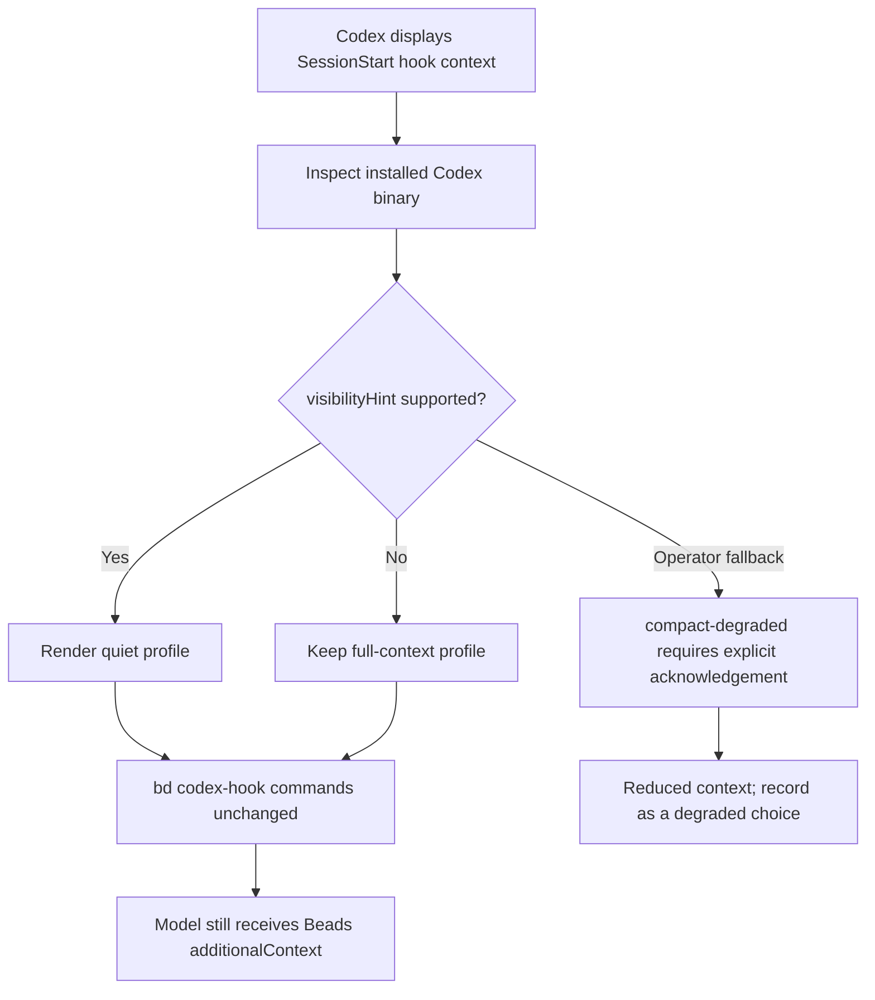

# Codex Beads Hooks

This reference covers Codex lifecycle hooks that inject Beads context into the
model. It exists because new Codex CLI versions may display SessionStart hook
context in the shell transcript, but the fix must not weaken automatic Beads
context injection.

## Rule

Keep `bd codex-hook SessionStart` as the full-context path unless the installed
Codex binary has a stable display-layer control that leaves
`hookSpecificOutput.additionalContext` available to the model.

Do not fix display noise by disabling hooks, redirecting stdout, switching the
default to `bd prime --memories-only`, using pointer-only context, or adding a
Beads-side quiet flag without fixture proof that the model still receives the
same context.

## Helper

Use the helper in dry-run mode first:

```bash
python3 scripts/configure_codex_beads_hooks.py \
  --project-dir . \
  --mode full-context \
  --json
```

`full-context` writes the normal Beads lifecycle hooks and preserves automatic
context injection:

```json
{
  "command": "bd codex-hook SessionStart",
  "statusMessage": "Loading Beads context",
  "type": "command"
}
```

When Codex exposes the stable `visibilityHint` hook field, the quiet profile
keeps the same Beads commands and adds only the display hint:

```bash
python3 scripts/configure_codex_beads_hooks.py \
  --project-dir . \
  --mode quiet \
  --apply
```

If the installed Codex binary does not contain the `visibilityHint` support
signal, quiet and verbose profiles fail closed. The helper reports the Codex
version, inspected binary paths, and support signal so the operator can decide
whether to upgrade Codex or keep the visible full-context hook output.

## Profiles

| Mode | Behavior | Context stance |
| --- | --- | --- |
| `full-context` | Renders `bd codex-hook` lifecycle commands without display hints. | Preserves automatic Beads context. |
| `quiet` | Adds `visibilityHint: "quiet"` only when Codex support is detected or explicitly forced. | Preserves Beads commands; display-layer only. |
| `verbose` | Adds `visibilityHint: "verbose"` only when support is detected or forced. | Inspection mode; display-layer only. |
| `compact-degraded` | Uses `bd prime --memories-only --hook-json` for SessionStart. | Requires `--allow-degraded-context`; not equivalent to full Beads context. |

The helper is dry-run by default. It writes `.codex/hooks.json` only with
`--apply`, and it preserves unrelated hook entries while replacing managed
Beads lifecycle hooks.

## Flow



## Subagents

Codex subagents and compacted sessions need the same durable Beads recovery
story, but do not overclaim hook support. Beads 1.0.5 does not support a
`SubagentStart` Codex hook event. Until both Codex and Beads support that event,
use `scripts/build_beads_brief.py` for internal subagent briefing and keep
outside contractors on boundary-checked packets from
`scripts/build_contractor_packet.py`.

## Validation

Before applying a quiet profile, prove that display suppression does not change
the context returned by Beads:

```bash
SESSION_CONTEXT="$(python3 scripts/cwo.py temp path --purpose beads-hooks --name beads-sessionstart.json)"
bd codex-hook SessionStart > "$SESSION_CONTEXT"
jq -r '.hookSpecificOutput.additionalContext' "$SESSION_CONTEXT" | wc -c
python3 scripts/configure_codex_beads_hooks.py --mode quiet --json
python -m unittest tests/test_configure_codex_beads_hooks.py -v
```

For current unsupported Codex builds, the accepted result is a fail-closed
quiet attempt and a working `full-context` profile.
