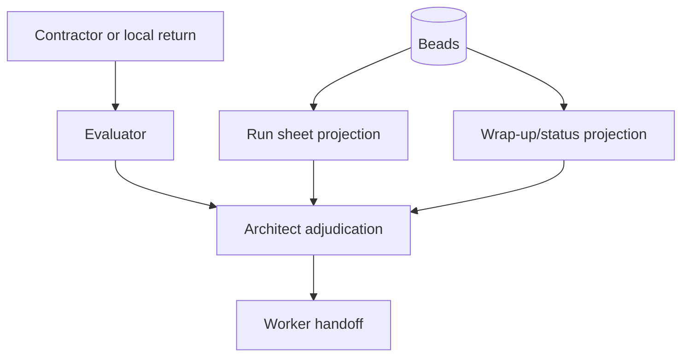

# Run Readiness Gate

Use a run readiness plan before worker handoff when a CWO run has broad
implementation scope, contractor or local-worker evidence, model synthesis, or
public/release risk.

The readiness plan is not a second source of truth. Beads remain canonical.
The plan is a reviewable projection that proves the run has enough structure
for workers to execute without guessing from a transcript.

## Adaptation Roadmap

| Adaptation | Status | Rule |
| --- | --- | --- |
| Run readiness gate | Implemented baseline | Validate before broad worker handoff. |
| Rubric-first readiness | Implemented as required readiness field | Create before worker handoff; evaluations, synthesis, wrap-up/status, and adjudication cite the same immutable version. |
| Run sheet projection | Implemented as projection renderer | Regenerate from Beads-backed readiness state; do not edit as parallel state. |
| Wrap-up/status projection | Implemented as projection renderer | Regenerate from Beads, validation, evaluation, and adjudication evidence. |
| Typed next-version rail | Implemented as required typed entries | Every deferred item needs a reason type and follow-up Bead. |
| Patrol or recurring work | Research-only | No scheduler or autonomous recurring execution until accepted research exists. |

## Required Decisions

- Each workstream has an owner and an exit condition.
- Each validation criterion maps to an artifact, validator, or review gate.
- Rubrics have a version, owner, schema reference, and immutable-per-run rule.
- Run sheet, wrap-up/status, and next-version artifacts are typed projections
  from durable Beads state.
- External and local returns are evidence until evaluation and architect
  adjudication.
- Unsupported or boundary-breaking returns are quarantined until corroborated.
- Next-version items have a typed reason and a follow-up Bead.
- Patrol or recurring work remains research-only until ownership, locking,
  history, failure containment, and provider-neutral execution are accepted.
- Worker handoff requires evidence: changed files, validation commands,
  accepted and rejected findings, residual risks, and follow-up Beads.

## Projection Rules

`scripts/render_run_projection.py` renders human views from a validated JSON
plan whose artifact-authority block declares Beads as the canonical source.
These views are deliberately non-authoritative:

```bash
python3 scripts/render_run_projection.py examples/sample-run-readiness-plan.json --projection run-sheet
python3 scripts/render_run_projection.py examples/sample-run-readiness-plan.json --projection wrap-up-status
python3 scripts/render_run_projection.py examples/sample-run-readiness-plan.json --projection next-version
```

Use `--format json` when another helper or CI check needs structured output.
Generated run sheets and wrap-up/status reports must be regenerated from Beads
plus validation, evaluation, and adjudication records. Do not edit them as a
parallel work database.

For end-of-plan resource accounting, use the separate execution status report
renderer. It summarizes explicit work-unit, expert profile, agent/model,
main-thread, second-opinion, quality, sabotage, malpractice, and evidence
disposition telemetry from audit logs, readiness records, acceptance decisions,
and return bundles. The terminal view defaults to expanded fan-out rows so
multi-role or multi-model utilization details remain visible; pass
`--layout summary` for the grouped table view. It is a projection only;
expected-but-unavailable calls, retries, tokens, timings, or active-time values
render as `?`, structurally irrelevant telemetry renders as `n/a`, and the JSON
output includes field-level available, missing, and not-applicable telemetry
gap counts:

```bash
python3 scripts/render_execution_status_report.py --format terminal
python3 scripts/render_execution_status_report.py --format terminal --layout summary
python3 scripts/render_execution_status_report.py --format json
```

The machine-readable output is documented by
`schemas/execution-status-report.schema.json`.

When `adjudication_record` declares accepted, rejected, or quarantined findings,
it must also include `evidence_refs` entries with `artifact`, `artifact_type`,
and lowercase SHA-256. The wrap-up/status projection renders those refs so the
architect decision is bound to evaluator, contractor-return, synthesis,
validation, or Beads-comment evidence instead of relying on self-attested
finding text alone.

Allowed `artifact_authority.projections[].type` values are `run-sheet`,
`wrap-up-status`, and `next-version`. Each projection must declare
`canonical_source: beads` and either a `source_command` or `source_bead`.

The current renderer consumes a validated readiness-plan JSON artifact that
was built from the Beads work graph. Direct `bd` projection is intentionally
left as future helper work rather than implied by this command.

## Next-Version Reason Types

Allowed `next_version_rail.reason_type` values are:

- `out-of-scope`
- `needs-credential`
- `needs-research`
- `hardening`
- `later-version`
- `blocked`

Every next-version item must name a follow-up Bead. Loose wish-list text is not
durable enough for CWO handoff.

## Patrol Boundary

Patrol or recurring work is research/proposal only until the research output
accepts the typed evidence values `ownership`, `locking`, `history`,
`failure_containment`, and `provider_neutral_execution`. Do not add a
scheduler, recurring worker, persistent controller, or autonomous execution
loop as part of readiness work.

## Machine-Readable Shape

Use `schemas/run-readiness-plan.schema.json` for the JSON shape and
`examples/sample-run-readiness-plan.json` as a minimal passing example.

Validate a plan:

```bash
python3 scripts/validate_run_readiness_plan.py examples/sample-run-readiness-plan.json
```

The validator checks the schema-critical invariants CWO needs before execution:
owners, exit conditions, criterion evidence, artifact authority, rubric
immutability and `criterion_ids`, provider provenance, quarantine rules,
boundary negative tests, next-version links, patrol stopping rule, and handoff
evidence.

## Human Template

Use `templates/run-readiness-plan.md` when the run needs a readable planning
artifact instead of JSON first. If both forms exist, the JSON artifact is the
validator input and the Markdown template is reader-facing support.

## Authority Model



Beads are canonical. Projection artifacts help humans review the state.
Evaluated contractor or local-worker returns are evidence. Architect
adjudication is the handoff decision.
