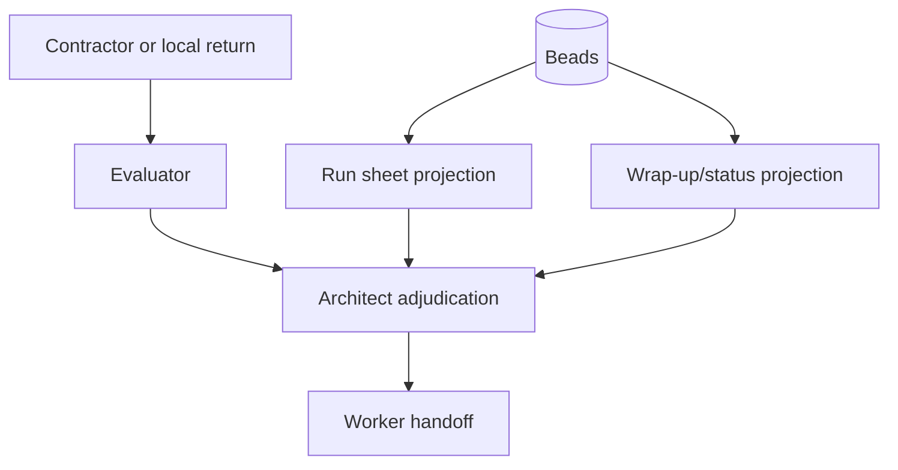

# Run Readiness Gate

Use a run readiness plan before worker handoff when a CWO run has broad
implementation scope, contractor or local-worker evidence, model synthesis, or
public/release risk.

The plan answers four questions before handoff: who owns each assignment, what
result is required, which checks establish completion, and what happens if work
cannot continue. It summarizes saved Beads state rather than creating a second
task database. Passing its validator checks the required structure; it does not
prove the work or a live integration succeeds.

## Adaptation Roadmap

| Adaptation | Status | Rule |
| --- | --- | --- |
| Run readiness gate | Implemented baseline | Validate before broad worker handoff. |
| Rubric-first readiness | Implemented as required readiness field | Create before worker handoff; evaluations, synthesis, wrap-up/status, and adjudication cite the same immutable version. |
| Run sheet projection | Implemented as projection renderer | Regenerate from Beads-backed readiness state; do not edit as parallel state. |
| Wrap-up/status projection | Implemented as projection renderer | Regenerate from Beads, validation, evaluation, and adjudication evidence. |
| Deferred work (`next_version_rail`) | Implemented as required typed entries | Every deferred item needs a reason type and follow-up Bead. |
| Patrol or recurring work | Research-only | No scheduler or autonomous recurring execution until accepted research exists. |

## Required Decisions

- Each workstream has an owner and an exit condition.
- Each validation criterion maps to an artifact, validator, or review gate.
- Rubrics have a version, owner, schema reference, and immutable-per-run rule.
- Run sheet, wrap-up/status, and next-version artifacts are typed projections
  from durable Beads state.
- External and local returns are evidence until evaluation and architect
  adjudication.
- Unsupported or boundary-breaking returns are quarantined until corroborated.
- Next-version items have a typed reason and a follow-up Bead.
- Patrol or recurring work remains research-only until ownership, locking,
  history, failure containment, and provider-neutral execution are accepted.
- Worker handoff requires evidence: changed files, validation commands,
  accepted and rejected findings, residual risks, and follow-up Beads.

## Projection Rules

`scripts/render_run_projection.py` renders human views from a validated JSON
plan whose artifact-authority block declares Beads as the canonical source.
These views are deliberately non-authoritative:

```bash
python3 scripts/render_run_projection.py examples/sample-run-readiness-plan.json --projection run-sheet
python3 scripts/render_run_projection.py examples/sample-run-readiness-plan.json --projection wrap-up-status
python3 scripts/render_run_projection.py examples/sample-run-readiness-plan.json --projection next-version
```

Use `--format json` when another helper or CI check needs structured output.
Generated run sheets and wrap-up/status reports must be regenerated from Beads
plus validation, evaluation, and adjudication records. Do not edit them as a
parallel work database.

For end-of-plan resource accounting, use the separate execution status report
renderer. It summarizes explicit work-unit, expert profile, agent/model,
main-thread, second-opinion, quality, sabotage, malpractice, and evidence
disposition telemetry from audit logs, readiness records, acceptance decisions,
and return bundles. The terminal view defaults to a compact dashboard for
80-column, half-height terminals; pass `--layout expanded` for full multi-role
or multi-model utilization rows, or `--layout summary` for grouped tables. It is
a projection only; expected-but-unavailable calls, retries, tokens, timings, or
active-time values render as `?`, structurally irrelevant telemetry renders as
`n/a`, and the JSON output includes field-level available, missing,
not-applicable, and missing-reason telemetry gap counts. When manual/provider
usage becomes available after dispatch, import it through a sanitized sidecar
before rendering:

```bash
python3 scripts/import_execution_telemetry.py --file usage-sidecar.json
python3 scripts/render_execution_status_report.py --format terminal
python3 scripts/render_execution_status_report.py --format terminal --layout expanded
python3 scripts/render_execution_status_report.py --format terminal --layout summary
python3 scripts/render_execution_status_report.py --format json
python3 scripts/replay_epic_convergence.py --input convergence-ledger.json > convergence-summary.json
python3 scripts/render_execution_status_report.py --convergence-summary convergence-summary.json --format terminal
```

Convergence replay is append-only: historical unknowns stay null rather than
being inferred or rewritten. Status output reports absolute productive,
validation, attestation, fit, monitoring, recovery, PM, architect, and unknown
call counts together with replay-target results.

Closure pressure begins when acceptance or independent validation starts. The
current work unit must carry any routine correction and one explicit
`retain`, `correct`, `quarantine`, `defer`, or `close` disposition; do not add a
routine repair child. Main-thread model and effort recommendations are
advisory. The user's selected effort remains authoritative and a recommendation
mismatch does not stop or pivot execution.

The machine-readable output is documented by
`schemas/execution-status-report.schema.json`; telemetry sidecars are documented
by `schemas/execution-telemetry-import.schema.json`.

When `adjudication_record` declares accepted, rejected, or quarantined findings,
it must also include `evidence_refs` entries with `artifact`, `artifact_type`,
and lowercase SHA-256. The wrap-up/status projection renders those refs so the
architect decision is bound to evaluator, contractor-return, synthesis,
validation, or Beads-comment evidence instead of relying on self-attested
finding text alone.

Allowed `artifact_authority.projections[].type` values are `run-sheet`,
`wrap-up-status`, and `next-version`. Each projection must declare
`canonical_source: beads` and either a `source_command` or `source_bead`.

The current renderer consumes a validated readiness-plan JSON artifact that
was built from the Beads work graph. Direct `bd` projection is intentionally
left as future helper work rather than implied by this command.

## Next-Version Reason Types

Allowed `next_version_rail.reason_type` values are:

- `out-of-scope`
- `needs-credential`
- `needs-research`
- `hardening`
- `later-version`
- `blocked`

Every deferred item must name a follow-up Bead as well as its reason. A wish list
without a task leaves the next session unable to establish ownership or readiness.

## Patrol Boundary

Patrol or recurring work is research/proposal only until the research output
accepts the typed evidence values `ownership`, `locking`, `history`,
`failure_containment`, and `provider_neutral_execution`. Do not add a
scheduler, recurring worker, persistent controller, or autonomous execution
loop as part of readiness work.

## Machine-Readable Shape

Use `schemas/run-readiness-plan.schema.json` for the JSON shape and
`examples/sample-run-readiness-plan.json` as a minimal passing example.

Validate a plan:

```bash
python3 scripts/validate_run_readiness_plan.py examples/sample-run-readiness-plan.json
```

The validator checks the schema-critical invariants CWO needs before execution:
owners, exit conditions, criterion evidence, artifact authority, rubric
immutability and `criterion_ids`, provider provenance, quarantine rules,
boundary negative tests, next-version links, patrol stopping rule, and handoff
evidence.

## Requirement Baselines

A requirement baseline records what one Bead must deliver before the work
starts, so that later checks compare results with obligations that were fixed
in advance rather than with whatever passed. It follows
`schemas/requirement-baseline.schema.json`. Each criterion has a stable ID, the
requirement and where it comes from, the expected observable outcome, whether
it applies (`required`, or `not-applicable` with a reason) and the evidence
kind it needs (`artifact`, `validator` or `review-gate`, the readiness evidence
types). The record has no place for results; a criterion carrying a status,
observation or evidence field is refused.

The baseline digest is SHA-256 over the record serialized as JSON with sorted
keys, no whitespace and UTF-8 text. The Bead retains each version by a comment
whose whole text is the reference line
`cwo-requirement-baseline bead=<id> version=<n> digest=sha256:<hex>`.
`cwo_core.requirement_baseline` checks that every version of a chain is
recorded in order and that the Bead records no other baseline; it reads a Bead
projection and never writes to Beads. A comment that carries a reference line
inside other text, or has a line that starts like one in any letter case, is
refused as well; prose that only mentions the prefix is not a reference.

An amendment (`schemas/requirement-amendment.schema.json`) names the prior
digest and version, carries the complete next baseline, and lists the
criterion IDs it adds, removes and changes, which must be exactly the
difference. Only amendments that add criteria are supported. Removing or
changing a criterion would remove or weaken an obligation, which needs
authority that CWO cannot verify yet, and a clarification cannot be told apart
from a weakening, so those amendments are refused and the baseline stays as
recorded.

A readiness plan names the baseline it follows in `requirement_baseline`
(record type, Bead, version and digest). The validator then requires the
baseline and any amendments, in order:

```bash
python3 scripts/validate_run_readiness_plan.py plan.json --baseline baseline.json --amendment amendment-1.json
```

The rubric must list exactly the baseline's required criteria, and each
matrix row must use the evidence kind the baseline records for that criterion.
An omitted, replaced or invented criterion fails. A plan that names a baseline
fails without it; projections render without this check. Readiness plans may
still reference evidence that does not exist yet.

## Candidate Identity

A candidate identity records exactly what a Bead's delivery claims, so that
evidence and approvals can bind to one candidate and any later change is
visible. It follows `schemas/candidate-identity.schema.json` and names:

- the Bead and the requirement baseline version and digest the candidate is
  meant to satisfy;
- the repository, by its root commits, the base commit the work started from
  (an ancestor of the candidate) and the candidate commit and tree;
- a manifest of every path whose working content differs from the candidate
  tree: its change, file type, mode, size and the SHA-256 of its bytes or link
  target. Untracked paths the record excludes, such as evidence directories,
  are left out; an exclusion cannot contain tracked files or delivery scope
  paths, and changed tracked files are always in the manifest. Ignored
  untracked files are not part of the candidate;
- the delivery scope: the repository paths the delivery claims, each of which
  must exist in the candidate. A scope that names live resources (a retired
  service, a deployed name) is refused, because binding their independently
  observed state needs a producer-bound observation record that does not exist
  yet;
- the SHA-256 of the full permission and special bits (read, write and
  execute for user, group and other, setuid, setgid and sticky) of the
  repository root and of every delivered file, symlink and directory. The
  manifest records Git's mode; this digest binds the rest, so a change such
  as 0644 to 0666, 0755 to 4755 or a directory made group-writable is a
  mismatch. Ignored and excluded paths are not delivered and not bound.

The record holds no results and no approvals. A commit SHA alone does not
identify dirty deliverables, and a content digest does not say who approved
the content. The candidate digest uses the same serialization as the baseline
digest, and the Bead retains a candidate by a comment whose whole text is
`cwo-candidate-identity bead=<id> digest=sha256:<hex>`:

```bash
python3 scripts/candidate_identity.py record --baseline baseline.json --base-commit <commit> --scope src --exclude evidence --output /tmp/candidate.json
python3 scripts/candidate_identity.py verify --baseline baseline.json --candidate /tmp/candidate.json --read-beads
```

The manifest comes from the inert workspace capture: raw bytes, modes and
types read from the filesystem without following symlinks, compared with the
candidate tree read from the object store. The index and its flags
(assume-unchanged, skip-worktree), `core.filemode` and Git conversions
(clean, smudge and process filters, end-of-line and encoding attributes) have
no part in it, so staging alone changes nothing and none of them can hide a
change. No Git command runs against the working tree or its repository, so no
configured filter, hook or monitor runs; the history (root commits, base
ancestry) is read from the object store, and the base commit is named by its
full object ID.

Every delivered symlink, committed or not, must resolve over the delivered
content alone to a delivered file or directory. A link into excluded, ignored
or absent content, outside the repository, into `.git`, to the repository root
or to a directory holding an excluded path is refused, because delivered
content would then depend on content the candidate does not bind. Resolution
follows the kernel: a trailing slash or a `.` after a file is refused, and a
chain of more than 40 links, counting the first, is refused. A gitlink is
refused wherever it is, even under an excluded or ignored path. Code that
opens or imports ignored or excluded files by name is not detected: candidate
identity binds content and does not analyse what delivered code loads, so keep
everything delivered code needs tracked or in the manifest.

`record` writes the record to a new file and
prints the reference line; posting it is a plain `bd comment`. `verify`
identifies the working tree again with the record's base, scope and exclusions
and refuses any difference: another repository, commit or tree, a path
added to, removed from or changed in the manifest, or changed permission or
special bits on delivered content. It also refuses a candidate recorded
against an older baseline version, one the Bead does not record, one recorded
before the baseline version it claims and one that a later candidate reference
supersedes, as well as a malformed or embedded candidate reference. The only
Beads command either runs is `bd show` (`verify --read-beads`); `--bead-json`
reads a saved projection instead.

## Human Template

Use `templates/run-readiness-plan.md` when the run needs a readable planning
artifact instead of JSON first. If both forms exist, the JSON artifact is the
validator input and the Markdown template is reader-facing support.

## Authority Model


```mermaid
flowchart TD
    Beads[(Beads)] --> RunSheet[Run sheet projection]
    Beads --> WrapUp[Wrap-up/status projection]
    Contractor[Contractor or local return] --> Evaluation[Evaluator]
    Evaluation --> Architect[Architect adjudication]
    RunSheet --> Architect
    WrapUp --> Architect
    Architect --> Workers[Worker handoff]
```

Beads are canonical. Projection artifacts help humans review the state.
Evaluated contractor or local-worker returns are evidence. Architect
adjudication is the handoff decision.

## Closing Beads

`scripts/close_bead_with_summary.py` records closure memory, but it does not
record successful completion yet. Before any Beads write it refuses `completed`
and every other success disposition, because it cannot verify a recorded
requirement baseline, the exact delivered candidate and passing evidence for
every requirement (issue #37). Nothing is written when it refuses.

These outcomes remain available:

| Disposition | Use | Bead afterwards |
| --- | --- | --- |
| `pending-acceptance` | The work is delivered and validated as far as the lead can tell; acceptance is not verified | Open; the operator decides whether to close it |
| `deferred` | The work is postponed | Open |
| `superseded`, `split` | The work continues in other Beads | May be closed with `--close` |
| `rejected`, `abandoned` | The work will not be delivered | May be closed with `--close` |

Planning, readiness validation and `--dry-run` previews of these outcomes are
unaffected. Successful closure returns only when the helper verifies the
baseline, the candidate and the evidence itself; a narrative summary will not
satisfy it. Requirement baselines and candidate identities (above) are two of
those parts. The closure helper reads neither yet, and neither a recorded
baseline nor a verified candidate makes successful closure available.
